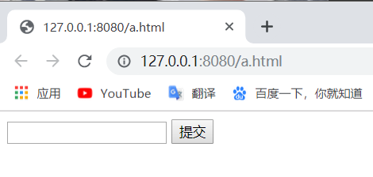
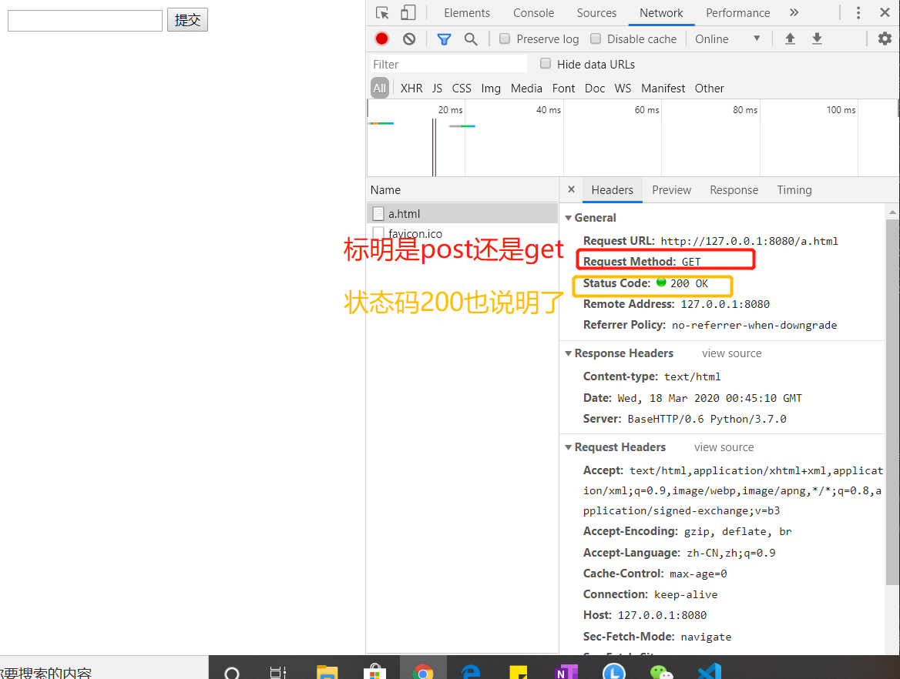
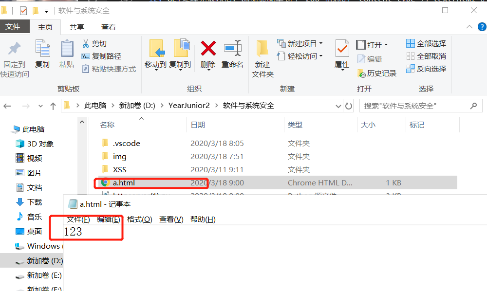
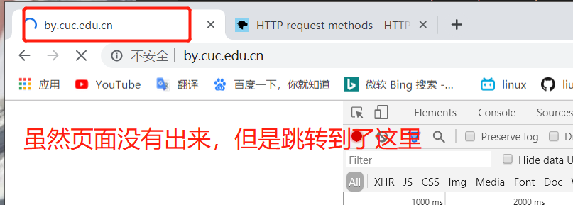
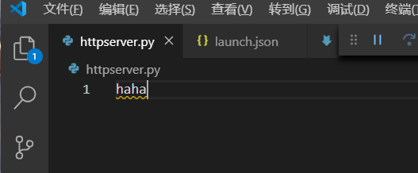

# HTTPServer
## HTTPServer实验
1. 这个是使用python原生的cgi和http.server两个库运行的一个简单的http服务器程序，因为没有使用第三方库，所有不需要使用pip安装依赖
2. HTTPServer：重写了`init`函数，增加了打印输出语言，然后字节调用父类的 `init`传递了服务器运行需要的地址，端口等参数。监听地址和端口是 0.0.0.0:8080。
3. vscode调试httpserver.py文件后，会生成一个launch.json        
4. 代码跑起来以后，就可以在浏览器中进行访问[http://127.0.0.1:8080/a.html](http://127.0.0.1:8080/a.html) 
* 其中 `http://127.0.0.1:8080`是协议服务器地址和端口,`/a.html`就是路径                         
* 通常，一个静态的http服务器，这里的路径`/a.html`就是http服务器根目录下的文件,那么就去读 a.html文件，如果文件不存在，就返回404
* 动态服务器这里可能是文件和参数，或者是对应其他服务器后台的处理过程，例如`http://127.0.0.1:8080/a.php?p1=x`指定有`a.php`来处理这个请求，参数是`p1=x`，问号后面是参数，可以有多个。
可以看到网页内容是一个表单                                                        
                             
5. 下断点，然后刷新浏览器，代码就会断点命中中断。                       
                              
6. 打开浏览器的调试模式，到`sources`这个tab就看到了服务器向浏览器返回的数据，就是我们的`form_html`变量                 
                           
表单指定了使用post方式向服务器提交数据
7. network标签里可以看到完整的请求响应过程                  
                              
8. 提交框里填写123，执行完成后，目录下会多一个a.html，内容为123                 
                             
9. 再访问 http://127.0.0.1:8080/a.html 时，这个时候a.htm已经存在了所以是运行的do_GET(self)的else部分，直接把文件内容会写给浏览器 
10. 再访问一个不存在的页面，比如b.html，会出现那个默认的form
11. 在输入框输入`<html><body><script>alert('XSS')</script></form></body></html>`,这段内容就会被写入b.html                          
                           
12. 再次访问b.html的时候，**不要刷新，刷新是重复上一次的POST请求，直接在地址栏里回车**，整个页面被载入，script语句在浏览器上执行,出现弹窗           
                              
理论上，任何的js都是可以被执行的。js可以实现非常丰富的功能。比如可以让你扫码支付。
14. 在 c.html里填入`<html><body><script>window.location.href='http://by.cuc.edu.cn'</script></form></body></html>`,下次再访问c.html的时候。页面跳转到了`by.cuc.edu.cn`，这就是` window.location.href='http://by.cuc.edu.cn'` 这段脚本的功能                   
                              
15. 在浏览器中访问 http://127.0.0.1:8080/httpserver.py ，在sources中，可以看到源代码      
                             
16. 由于服务器没有做任何过滤，只要是存在的文件，就发送给客户端，源代码文件也发送给了客户端。现在黑客可以知道整个后台的逻辑了。如果还有一些配置文件，比如数据库地址和访问口令等，也都被泄露了。更严重的是，黑客甚至可以注入后端代码。
17. 由于回写到文件，可以构造一个http post请求，把httpserver.py文件改写了。但是构造这个请求用浏览器就不行了，需要采用curl等更基础的工具裸写post请求发送给服务器        
18. 到浏览器调试工具的` elements`处，由于后台只处理名为a的表单项，所以需要把input的name改为a，**在做之前，记得把httpserver.py复制一份，要不然就没了**
                  
19. 然后输入框输入`haha`,`httpserver.py`，它被改变了，变成了我们所填入的`haha`                  
                              
20. 所以，甚至可以给后端注入代码。当然，如果只是注入一个hahaha 服务器就挂了。再也跑不起来了。所以，这是一个及其简单，但是漏洞百出的web服务器。这就是不做任何过滤，直接写入数据的危害             
## httpserver.py代码解释
```python
# -*- coding: utf-8 -*-
import sys
import cgi
from http.server import HTTPServer, BaseHTTPRequestHandler

# 以下开始是整个代码的主体，也是出问题的地方
class MyHTTPRequestHandler(BaseHTTPRequestHandler): 
    # 这个是 HTTPServer 的回调,用来处理到达的请求，也就是0.0.0.0:8080 上有任何的HTTP请求到达时，都会调用 MyHTTPRequestHandler来处理
    # MyHTTPRequestHandler 直接 继承自 BaseHTTPRequestHandler，其中 BaseHTTPRequestHandler 的 do_GET和do_POST两个方法被重写
    field_name = 'a'  #这里的表单是使用的post方法提交数据。
    form_html = \   
        '''
        <html>
        <body>
        <form method='post' enctype='multipart/form-data'> 
        <input type='text' name='%s'>
        <input type='submit'>
        </form>
        </body>
        </html>
        ''' % field_name
    
    # do_XXX函数，就是处理对应的客户端请求的函数
    def do_GET(self):
        # 如果文件不存在，应该返回404
        # 这里做了一个特殊的处理，如果指定的文件不存在，还是返回200，表示请求路径是正确的，可以处理，然后返回一个默认的页面。这个页面就是 form_html的变量，在FileNotFoundError异常处理过程中写回
        self.send_response(200) 
        # GET处理完成以后，浏览器就拿到了200状态的Content-type为text/html的form_html
        self.send_header("Content-type", "text/html")
        self.end_headers()
        try:
            file = open("."+self.path, "rb")  # self.path 是这个请求的路径
        except FileNotFoundError as e:
            print(e)
            self.wfile.write(self.form_html.encode()) # wfile和rfile对应http响应和请求的body部分
        # 再访问时，即文件存在时，执行以下部分
        else:
            content = file.read()
            self.wfile.write(content)
    #  点提交按钮后do_POST函数回被调用 
    def do_POST(self):
        #解析了客户端提交的请求，将form组织为python的dict数据类型
        form_data = cgi.FieldStorage(          
            fp=self.rfile,                           # 原始的请求的body部分
            headers=self.headers,                    # 原始的请求的头部
            environ={
                'REQUEST_METHOD': 'POST',
                'CONTENT_TYPE': self.headers['Content-Type'],
            })
        fields = form_data.keys()
        if self.field_name in fields:  # 处理了用户提交，写入文件
            input_data = form_data[self.field_name].value   #就是你在编辑框中填入的数据
            file = open("."+self.path, "wb")
            file.write(input_data.encode())

        self.send_response(200)
        self.send_header("Content-type", "text/html")
        self.end_headers()
        self.wfile.write(b"<html><body>OK</body></html>")


class MyHTTPServer(HTTPServer): # MyHTTPServer类，是继承自原生的HTTPSever
    def __init__(self, host, port):
        print("run app server by python!")
        # 指定了 MyHTTPRequestHandler 来处理 http请求，那么当用get方法请求，就会调用 do_GET,POST方法请求，就会调用 do_POST函数
        HTTPServer.__init__(self,  (host, port), MyHTTPRequestHandler)


if '__main__' == __name__:
    server_ip = "0.0.0.0"
    server_port = 8080
    if len(sys.argv) == 2:
        server_port = int(sys.argv[1])
    if len(sys.argv) == 3:
        server_ip = sys.argv[1]
        server_port = int(sys.argv[2])
    print("App server is running on http://%s:%s " % (server_ip, server_port))

    server = MyHTTPServer(server_ip, server_port)
    server.serve_forever()

```
## 实验结论
1. [http请求的方法](https://developer.mozilla.org/en-US/docs/Web/HTTP/Methods)
* http请求有很多种methods，但是我们通常使用得最多的，是`GET`和`POST`。比如，直接在浏览器中输入链接，浏览器拿到地址以后，默认是采用`GET`方式向服务器发送请求。所以`GET`方式最常见。
* 所以通常来说，从服务器获取数据，使用`get`方法，向服务器提交数据，使用`post`方法。

2. web服务器搭建的时候就需要设置一些过滤器，定制一些过滤规则，以防一些恶意的输入
## 参考资料
* [http请求的方法](https://developer.mozilla.org/en-US/docs/Web/HTTP/Methods)

