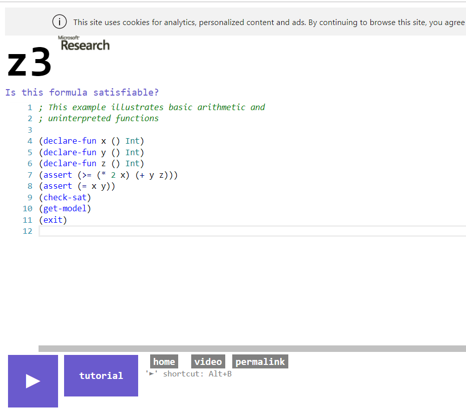
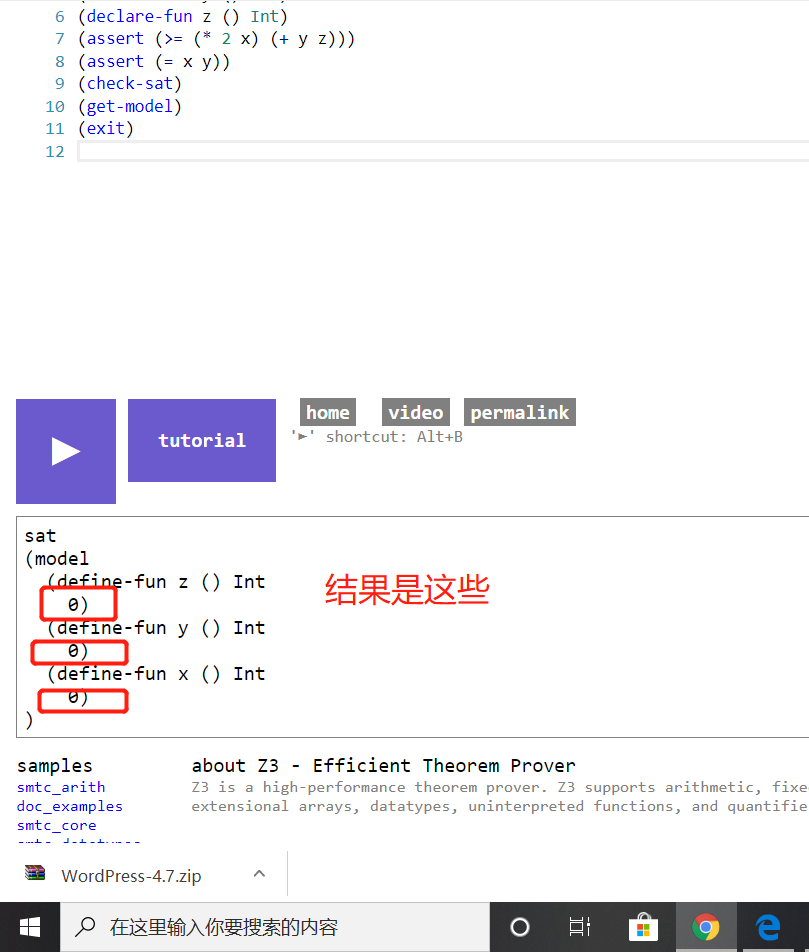
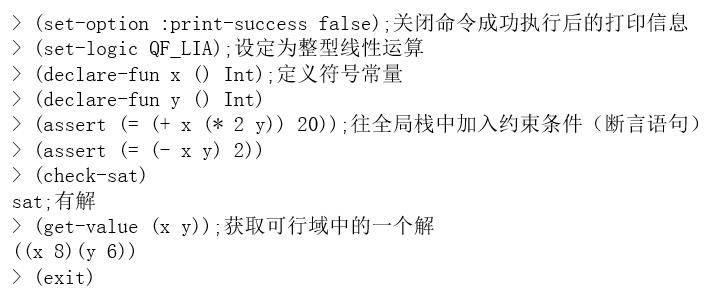
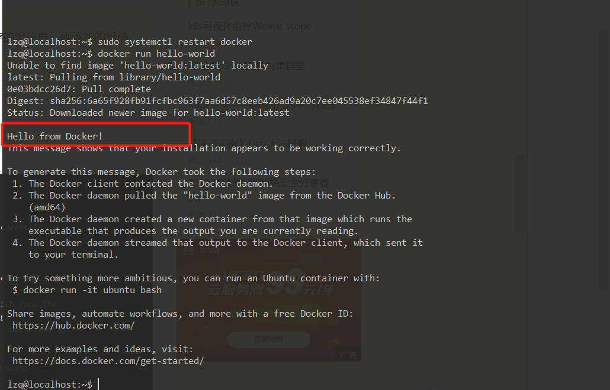
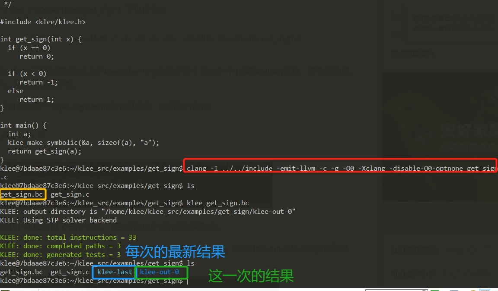
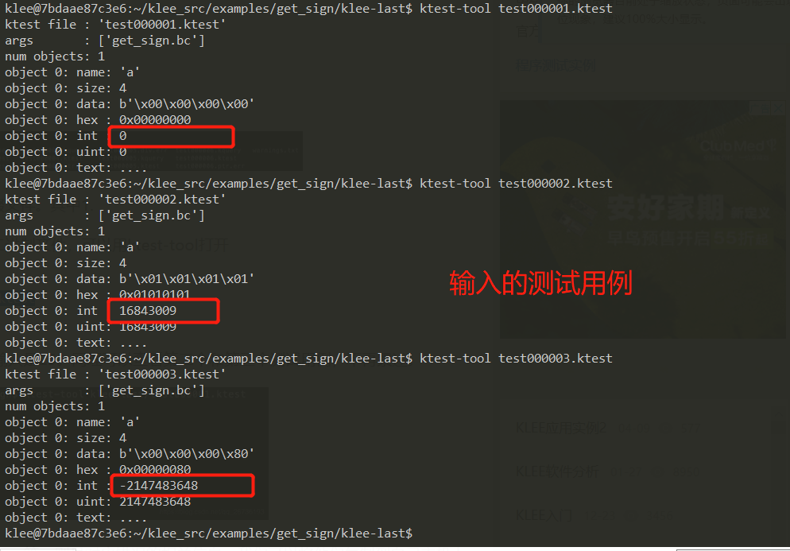
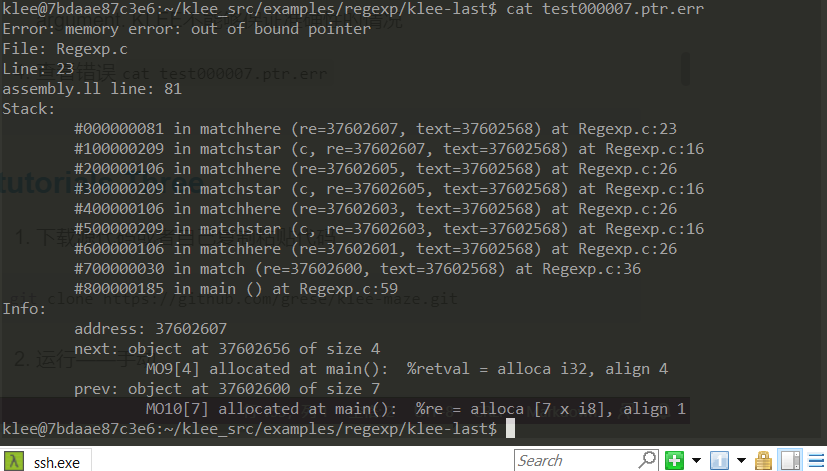
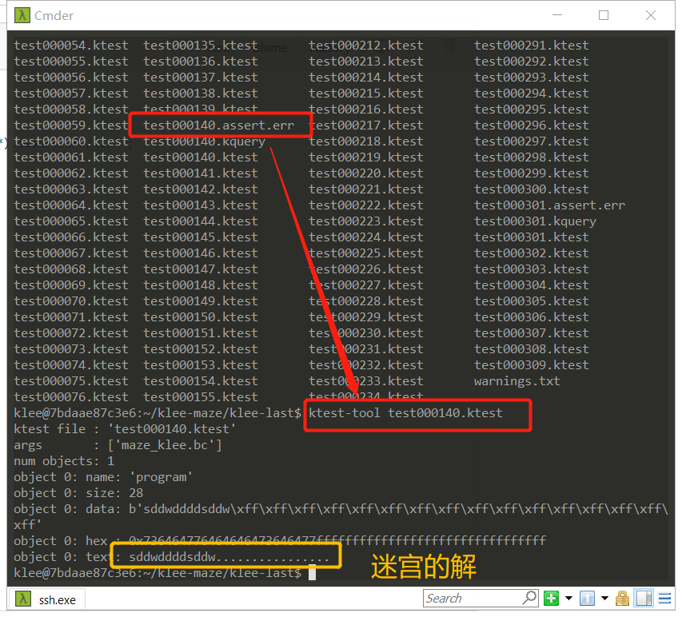

# KLEE
## 符号执行
1. 符号执行是一种程序分析技术，和模糊测试的思路不一样，模糊测试是吧测试对象当做一个黑盒子，不深入理解内部原理。符号执行是白盒测试技术，是基于程序分析的。或者说是一种程序分析技术，需要解析程序的源码（或者至少是反汇编后的汇编代码）。黑盒测试主要通过操纵其公开接口对软件进行评估，其中最知名的黑盒测试是模糊测试（Fuzzing）。模糊测试或者模糊化是一种软件测试技术，通常是自动化或者半自动化的，它能提供有效的、未预期的、随机的数据作为程序的输入。
2. 模糊测试能产生很多崩溃，分析人员通过这些崩溃作为分析问题的起点，以便确定漏洞的可利用性。然而，因为对程序控制流缺乏语义上的理解，模糊测试有代码覆盖率低的缺陷，即使是当前最高级的模糊测试技术也很难完全覆盖大型程序的所有路径。举个例子，对于以整形数据为路径分支条件，含有长为32比特的常量的约束等式条件（如if(v==4)），Fuzzing测试仍然有可能达到其上限次数（2^32次尝试）才能找到使得此等式为true的值。那么这个if为true分支被测试到的可能性极低。
3. 符号执行就是为解决这个问题而设计的。符号执行作为一种能够系统性探索程序执行路径的程序分析技术，能有效解决模糊测试冗余测试用例过多和代码覆盖率低这两个问题。
4. 符号执行的主要思想是以符号输入代替程序的实际输入，以符号值代替程序运行过程中的实际值，并以符号布尔表达式表示程序中的分支条件。这样，一条程序执行路径就包含了一系列的符号变量、表达式赋值以及约束条件等，程序中的各路径的信息能以符号的形式被完整记录和保存。我们把某条执行路径上的所有分支条件所组成的约束集（Constraint Set）称为路径约束或路径条件（PC, Path Constraint，Path Condition）。符号执行的主要目的是通过对路径约束的求解来判断此条路径的可达性（Feasibility），并能给出执行此条路径的实际测试输入。
5. 这个描述有点抽象，简单来说，符号执行的目的是覆盖程序执行的每一个分支。方法就是查看和收集程序执行过程中每一个分支条件的具体条件，把这些具体条件收集起来，变成一个数学的表达式，然后通过一些方法自动化的求解这些表达式，得到满足执行程序的路径的具体的输入的值。就可以覆盖特定的程序分支了。
6. 举个例子
                              
* 这个图，左边的是一段示例代码，一共13行，包括两个函数，一个main函数，一个foo函数。程序有两个输入，从外部读入的数据x和y。foo函数以x和y作为条件，内部有分支。假设在第五行有一个bug。我们的目的是有一种自动化的方法来找出这个bug。
* 前面已经说了Fuzzing技术在某些特定情况下有可能极其小得概率才能覆盖到特定分支，所以Fuzzing技术最大的问题就是代码覆盖率不高。对于穷尽每个执行路径目标来说有点难。
* 那么符号执行在解析代码的情况下，首先把程序的每一个分支画出来。形成一个称为符号执行树的数据结构。这个符号执行树，和程序的控制流图有点类似。但是它要明确每个分支的具体的执行路径条件。比如第一个分支的执行条件是y>x，第二个分支的执行条件是y< z+10 。x和y都是输入数据，在数学上来说，都是未知数。如果我们能够有一种方法，可以求解y>x的一个满足解和一个不满足解。那么是不是就找到了覆盖两个分支的两个测试用例。同样，对第二分支来说，在满足y>x的情况下，同时再满足y< z+10或者不满足 y< z+10，就能得到两个二级分支的具体的输入数据。
* 这里多了一个变量z，通过分析代码发现，z并不是一个新的数据数据，所以他并不是未知数，而是其他未知数赋值而来，所以每一个步，我们都记录下这种赋值关系，形成一个“表达式组”，或者，说得简单点，我们初中的时候学的“不等式组”。
* 理论上来讲，每一个程序执行的分支，每一个“执行路径”都有一个确定的不等式组作为执行条件。我们称为“约束”。
* 如果能求解到这个不等式组的一个解，那么就可以构造出专门覆盖这条路径的测试数据了。我们称为“约束求解”
* 这里，对于我们想要找的那个bug，第五行的代码。最终形成一个这样的“约束条件”
                             
是这一个具体路径的路径约束。
7. 下面的问题就是如何求解这个约束。我们的目的当时是自动化求解，不是人工求解。而且我们的目的是得到一个满足解即可，不用得到解析解。也就是只需要得到一个满足这个不等式组的具体的值，就等达到目的。
8. 如果我们把每一个路径的约束全部求解一遍，那么我们就能得到100%代码覆盖率的测试数据集。能够充分测试一个软件，找出软件中所有潜在的bug和漏洞。
9. 想法很好，难度很大。符号执行技术在上个世纪70年代被提出之后，受限于当时计算机的计算能力和约束求解技术的不足，并没有取得太大的进展。近年来，由于可满足模理论(SMT)研究以及动态符号执行技术的提出和应用使得符号执行技术研究有了革命性的进展，并已经被学术界和业界广泛应用于软件测试、漏洞挖掘、模型验证等领域。
也就是上面那个基本想法，已经提出来50年了。但是我们一直找不到一种自动化求解约束表达式的方法，所以也停留在理论层面。但是最近十几二十年情况不一样了。我们有了一种新的方法，并且开发出了工具，可以做到了。
10. 抽象一点，布尔可满足性问题（SAT，Boolean Satisfiability Problem），又称为命题可满足性问题（Propositional Satisfiability Problem），通常缩写为SATISFIABILITY或者SAT。布尔可满足性问题主要作用是在使用某种特定的语言描述对象（变量）的约束条件时，求解出能够满足所有约束条件的每个变量的值。SAT求解器已经被用于解决模型检查、形式化验证和其它包括成千上万变量和约束条件的复杂问题。但SAT问题是个NP完全问题，具有比较高的复杂度，且直接使用SAT求解器对程序进行分析的话需要需将问题转化为CNF形式的布尔公式，这给转化工作带来很大的困难。
11. 学过算法复杂度的同学知道，数学家已经证明了所有的NPC问题，都可以转化为SAT问题，后来发现一种算法，可以缓解这个问题，并在一定程度上求解。具体算法我们不用去深入了解，因为前人已经开发出工具了，简而言之是一种基于多维空间收敛搜索的方法。
## SAT 求解器
1. 这个工具呢，我们称为 SAT 求解器。或者他的变种SMT 求解器。可满足模理论(SMT，Satisfiability Modulo Theories)主要用于自动化推论（演绎），学习方法，为了检查对于一些逻辑理论T的一阶公式的可满足性而提出的。SMT技术主要用于支持可推论的软件验证，在计算机科学领域已经被广泛应用于模型检测（Model Checking），自动化测试生成等。可以被用于检查基于一种或多种理论的逻辑公式的可满足性问题。典型的应用理论主要包括了各种形式的算术运算（Formalizations of Various Forms of Arithmetic），数组（Arrays），有限集（Finite Sets），比特向量（Bit Vectors），代数数据类型（Algebraic Datatypes），字符串（Strings），浮点数（Floating Point Numbers），以及各种理论的结合等。
2. 相对于SAT求解器，而言SMT求解器不仅仅支持布尔运算符，而且在使用SMT求解器的解决问题的时候不需要把问题转化成复杂的CNF范式，这使得问题得以简化。
3. 不过说白了就是一个结论，上面我们总结出来的“约束求解”问题有自动化的方法了，而且已经有人开发了工具了。而且不止一款，有很多款这样的工具。其中比较优秀的是Z3，微软研究院开发的。
                              
## 具体例子
* [约束求解器具体例子](https://rise4fun.com/z3)
1. 打开网页后可以看到的是SMT 求解器使用的一种描述语言。来描述变量之间的约束关系。                       
                             
2. 简化例子                  
                              
* `Is this formula satisfiable?`这句话已经说明了，我们是来检测这个formula是否可满足的。这个formula呢，按照工具的要求语法，写成一种固定的形式。
* 一二行是注释，3、4、5三行相当于定义了三个变量。这三个变量都是Int型的。
* 7、8两行就是定义了两个约束。这里的写法和我们习惯性的写法略微不一样。运算符写在前面，运算数写在后面。第一个约束表达式实际是。2*x >= y+z。就是一种固定语法而已。
* 9 10 11行是要求求解器做三个具体的事情。
    * 第一个是检测是否这个表达式是否满足。也就是有解还是没有解。当然会有没有解的表达式组的。例如 x>y and x< y 不管xy怎么取值，都没有解。就是一个不满足的情况。
    * 那么我们这个例子中，工具给出的结果是满足 sat。
    * 然后是要 get-model，其实就是得到解。一个具体的满足解。然后求解器给出了x=0 y=0 z=0就能满足两个约束。
* 11行就简单了，告诉求解器，工作做完了可以退出。
* 运行完会发现得出结果 0 0 0
                             
3. 改编使之符合上个例子
```bash
(declare-fun x () Int)
(declare-fun y () Int)
(declare-fun z () Int)
(assert (= z (* 2 x)))
(assert (> x y))
(assert(< y (+ (* 2 x) 10)))
(check-sat)
(get-model)
(exit)

```
                             
## SMT-LIB
1. 然后是不是编程实现这种自动化的格式转化，就能实现一个全自动能完成100%代码覆盖率，生成每一条路径的测试数据的自动化工具。实际上说有的SMT求解器都已经标准化了，上面的那种描述语言是所有约束求解器都遵守的输入语言。成为SMT-LIB.
2. SMT-LIB（The satisfiability modulo theories library）自从2003年开始发起的为SMT理论研究提供标准化支持的项目，旨在促进SMT理论的研究和开发。SMT-LIB的目的主要如下：为SMT系统提供标准化严谨的背景理论描述；发展和促进SMT求解器的输入和输出语言；为SMT求解器研究团队建立和提供大型测试集library等。
定义 如果对于用户声明(declare)的常量和函数，存在一个解（interpretation0能使全局栈里面的所有的公式集（the set of formulas）为true，则我们称这些公式集是可满足（satisfiable）的。
3. 再举个例子                      
                              
* 这个为SMT-LIB V2语言在实际约束求解中的应用。其中declare-fun 命令用于声明一个函数，当函数里面参数为空时，表示声明一个符号常量；assert命令用于添加一个约束式formula到SMT全局栈里面；check-sat 命令决定在栈里面的公式（formulas)是否是可满足的，如果是，则返回sat，如果不满足（not satisfiable，即unsatisfiable)，则返回unsat，如果求解器无法根据已有的formula决定是否满足，则返回unknown；get-value命令用于在check-sat命令返回的结果是sat的前提下获取满足使SMT求解器全局栈中所有formulas为true的其中的一个解。
4. 当前很多非常著名的软件测试工具都采用了符号执行技术，而且已经有很大一部分开放了源代码。例如：NASA的Symbolic (Java) PathFinder，伊利诺大学香槟分校（UIUC）的 CUTE和jCUTE，斯坦福大学（Stanford）的 KLEE, 加利福尼亚大学伯克利分校（UC Berkeley）的 CREST和 BitBlaze，瑞士洛桑联邦理工学院（EPEL）的S2E，卡内基梅隆大学（CMU）的Mayhem和Mergepoint，加利福尼亚大学圣巴巴拉分校（UC Santa Barbar)的angr等。
在工业领域也有符号执行工具被广泛使用，如Microsoft(Pex, SAGE, YOGI和PREfix), IBM (Apollo), NASA 和Fujitsu的 (Symbolic PathFinder)等。
5. 可以看出来，符号执行确实是计算机领域一个非常重要的研究点。很多著名大学都在研究这个东西。也包括一些非大学的著名研究机构。这些工具发现了很多软件的bug。比如SAGE，win7三分之一的安全漏洞是它发现的。
6. 上面说了这么多符号执行工具，这些工具是把我们刚才说的整个过程都实现了：根据代码生成符号执行树->收集路径的约束->转为SMT-LIB格式->输入给约束求解器->验证路径可达或者不可达，可达的情况下获得解->根据解自动构造输入数据
## [KLEE](https://klee.github.io/)
* [KLEE](https://klee.github.io/)
> 环境是Linux
1. 不同的符号执行工具在实现时有不同比如KLEE，只能分析C源码程序。后续的一些工具可以分析二进制程序。
KLEE是开源的，而且比较成熟文档比较多
2. KLEE能实现全自动化，唯一的缺点是需要在程序中进行少量的修改。                  
3. 例子                         
                              
* 这个`klee_make_symbolic(&a, sizeof(a), "a");`的作用就是a标记为需要求解的输入数据。
4. BitBlaze还有一些后续工具，能够实现输入数据的自动识别，更高级一些。
5. 使用KLEE一共就几个步骤：准备一份源码，标记要分析的输入数据，编译，使用KLEE来运行编译后的程序，得到KLEE自动生成的测试用例。最后把所有输入测试用例循环输入给被测试程序，完成自动测试。
6. KLEE当然不是使用的在线版本的示例性质的约束求解器。而是直接调用本地的二进制程序。Windows和Linux下都有Z3的可执行程序，Windows系统中是z3.exe，可以在官网下载。
## 符号执行的主要问题
1. 当程序中有循环的时候，按照符号执行树，每一个分支条件都是需要展开。这会造成程序的路径非常多。
* 循环是程序的一个基本结构，普遍存在的。这种情况要遍历每一个路径，实际路径数量会非常巨大。造成消耗的时间不可行。
* 这个问题称为路径爆炸，路径的数据量是分支数量的指数级。循环更加强了这个问题。还有当程序路径非常多，输入变量非常多的时候，会超过SMT求解的求解能力。
* 所以对大型程序，目前符号执行只是一种辅助性的手段。但是这种技术是有前景的，随着计算能力的增强，算法的优化和改进，未来可能成为程序分析、程序自动化测试和程序安全性分析的主要的形式化的方法。
## 实验背景
* ubuntu 16 server
## 实验完成度
* [x] 安装KLEE
* [x] 完成官方tutorials（至少完成前三个）
## 实验过程
### 安装docker
1. 安装命令
```bash
sudo apt-get update
sudo apt-get install \
    apt-transport-https \
    ca-certificates \
    curl \
    software-properties-common
## 添加软件仓库
## 阿里云仓库
curl -fsSL https://mirrors.aliyun.com/docker-ce/linux/ubuntu/gpg | sudo apt-key add -
sudo add-apt-repository \
     "deb [arch=amd64] https://mirrors.aliyun.com/docker-ce/linux/ubuntu \
     $(lsb_release -cs) \
     stable"

## 安装
sudo apt-get install docker-ce

## 添加访问权限
cd /var/run
ll | grep docker
sudo gpasswd -a ${USER} docker

sudo service docker restart
# 切换当前会话到新 group 或者重启 X 会话
newgrp - docker
```
2. 运行docker测试
```bash
docker run hello-world

Hello from Docker!
This message shows that your installation appears to be working correctly.

To generate this message, Docker took the following steps:
 1. The Docker client contacted the Docker daemon.
 2. The Docker daemon pulled the "hello-world" image from the Docker Hub.
    (amd64)
 3. The Docker daemon created a new container from that image which runs the
    executable that produces the output you are currently reading.
 4. The Docker daemon streamed that output to the Docker client, which sent it
    to your terminal.

To try something more ambitious, you can run an Ubuntu container with:
 $ docker run -it ubuntu bash

Share images, automate workflows, and more with a free Docker ID:
 https://hub.docker.com/

For more examples and ideas, visit:
 https://docs.docker.com/get-started/
```
                                      

### dockers环境下安装KLEE
1. 一条命令安装完成
```
docker pull klee/klee:2.0
```
                                      
2. 或者通过创建容器
```bash
# 创建临时KLEE Docker容器
docker run --rm -ti --ulimit='stack=-1:-1' klee/klee:2.0
# 创建永久容器
## 创建并进入容器
docker run -ti --name=klee_container --ulimit='stack=-1:-1' klee/klee:2.0

# 退出容器，检查容器是否依然存在
exit
docker ps -a

# 重新进入容器
docker start -ai klee_container

# 删除容器
docker rm my_first_klee_container
```
                                      
### KLEE官方tutorials
#### [tutorials One](http://klee.github.io/tutorials/testing-function/)
1. 在`klee_src/examples/get_sign`目录下的`get_sign.c`,是用来判断一个整数的正，负，或者为0.
```cpp
/*                                                            
 * First KLEE tutorial: testing a small function              
 */                                                           
                                                              
#include <klee/klee.h>                                        
                                                              
int get_sign(int x) {                                         
  if (x == 0)                                                 
     return 0;                                                
                                                              
  if (x < 0)                                                  
     return -1;                                               
  else                                                        
     return 1;                                                
}                                                             
                                                              
int main() {                                                  
  int a;                                                      
  klee_make_symbolic(&a, sizeof(a), "a");              //klee_make_sybolic是KLEE自带的函数，用来产生符号化的输入        
  return get_sign(a);                                         
}                                                             
```
2. 因为KLEE是在LLVM字节码上进行工作,所以将将.c编译为LLVM字节码
```bash
clang -I ../../include -emit-llvm -c -g -O0 -Xclang -disable-O0-optnone get_sign.c
```
3. 同目录下会生成一个get-sign.bc的字节码文件，然后进行测试
```bash
klee get_sign.bc
```
                                      
4. klee-last目录,.ktest文件是KLEE生成的测试用例，是二进制文件，可以用ktest-tool打开
```bash
cd klee-last
ktest-tool test000001.ktest
```
                                      

### [tutorials TWO](https://klee.github.io/releases/docs/v2.0/tutorials/testing-regex)
>测试一个简单的正则表达式的匹配函数。该实例的源程序在klee_dir/examples/regexp/regexp.c。通过本例将会学习如何通过KLEE编译和运行具体的实例，以及如何解读输出
1. 编译构造
```bash
cd klee_src/examples/regexp
clang -I ../../include -emit-llvm -c -g -O0 -Xclang -disable-O0-optnone Regexp.c
# klee Regexp.bc
klee --only-output-states-covering-new Regexp.bc
# 参数 --only-output-states-covering-new是用于限定输出，若不指定，会生成大量的ktest测试数据，大概有六千多，指定该参数则仅仅输出新覆盖输出
```
                               
2. 当KLEE在执行程序时发现错误，那么它会生成一个test case来展示该错误，并把相关信息写入文件testN，类型TYPE为err的文件中。进入`klee-last`目录会发现，eer文件                                    
                                      
                                      
3.  KLEE可以发现的错误包括
* ptr: Stores or loads of invalid memory locations.读写不可用的内存
* free: Double or invalid free(). 多次free同一空间或者是不可释放的空间
* abort: The program called abort(). 程序调用abort
* assert: An assertion failed. asset断言错误
* div: A division or modulus by zero was detected. 除数为0的情况
* user: There is a problem with the input (invalid klee intrinsic calls) or the way KLEE is being used. 不可用的klee调用
* exec: There was a problem which prevented KLEE from executing the program; for example an unknown instruction, a call to an invalid function pointer, or inline assembly. 由于某些原因阻止KLEE执行程序，例如未知的指令，调用无效函数指针，或者内联汇编
* model: KLEE was unable to keep full precision and is only exploring parts of the program state. For example, symbolic sizes to malloc are not currently supported, in such cases KLEE will concretize the argument. KLEE不能够保证准确性的情况
4. 查看错误`cat test000007.ptr.err`
                                      
* 每一行的backtrace包含 frame number, the instruction line (汇编程序assebly.ll的行号)，函数，参数和源代码位置信息。对于不同的错误，其所含信息也不同，例如内存错误，KLEE会显示无效地址、以及堆中的对象是什么，以及前后的地址。本例中，可以看到错误地址发生在上一个对象地址的下一个字节位置。
5. 修改测试方法
* KLEE在此程序中发现内存错误的原因不是因为正则表达式函数存在错误，而是测试驱动程序存在问题。问题是我们使输入正则表达式缓冲区完全是符号，但是match函数期望它是一个'\0'为结尾的字符串
* 第一种方法：将'\ 0'存储在缓冲区的末尾，通过明确声明约束，这将迫使测试用例包含'\0'在其中
                                      
                                      
* 第二种方法：使用klee_assume内部函数。klee_assume接受单个参数（无符号整数），该参数通常应使用某种条件表达式，并“假定”该表达式在当前路径上为真（如果永远不会发生，即该表达式可证明是假，则KLEE将报告错误）。
                                      
                                      

### [tutorials Three](http://feliam.wordpress.com/2010/10/07/the-symbolic-maze/)
1. 下载源代码或者自己复制粘贴代码
```bash
git clone https://github.com/grese/klee-maze.git
```
2. 运行——手动
```bash
cd klee-maze
gcc maze.c -o maze

### 
./maze
ssssddddwwaawwddddssssddwwww
```
                                      
3. 修改代码为maze_klee.c                    
                                      
4. 运行
```bash
cd klee-maze
clang -I ../klee_src/include -emit-llvm -c -g -O0 -Xclang -disable-O0-optnone maze_klee.c
klee --emit-all-errors maze_klee.bc
```           
                                    
5. 查看得出结果
```bash
./scripts/show_solutions.sh
``` 
                                        
或者手动查找,形如`testID.assert.err`对应的`testID.ktest`,然后用`ktest-tool testID.ktest`进行查看，中的solution就是正确答案                                
                                       
                                      

## 实验问题
1. 运行：`sudo docker run hello-world`
```
Unable to find image 'hello-world:latest' locally
docker: Error response from daemon: Get https://registry-1.docker.io/v2/: net/http: TLS handshake timeout.
See 'docker run --help'.
```
* docker在本地没有找到hello-world镜像，也没有从docker仓库中拉取镜像，出项这个问题的原因：是应为docker服务器再国外，我们在国内无法正常拉取镜像，所以就需要我们为docker设置国内阿里云的镜像加速器
* 需要修改配置文件 /etc/docker/daemon.json 如下
```bash
{
“registry-mirrors”: [“https://alzgoonw.mirror.aliyuncs.com”]
}
```
* 重启报错`Failed to start Docker Application Container Engine.`                    
                                      
* 编辑daemon.json文件中的内容有错,复制过来的符号是中文的，而不是英文的
* 再次重启`sudo systemctl restart docker`

2. docker使用时需要换源，但是vim没有下载
```bash
sudo mv /etc/apt/sources.list /etc/apt/sources.list.bak
sudo touch /etc/apt/sources.list
sudo chmod 777 /etc/apt/sources.list
echo "deb http://mirrors.aliyun.com/ubuntu/ xenial main" >> /etc/apt/sources.list
echo "deb-src http://mirrors.aliyun.com/ubuntu/ xenial main" >> /etc/apt/sources.list
echo "deb http://mirrors.aliyun.com/ubuntu/ xenial-updates main" >> /etc/apt/sources.list
echo "deb-src http://mirrors.aliyun.com/ubuntu/ xenial-updates main" >> /etc/apt/sources.list
echo "deb http://mirrors.aliyun.com/ubuntu/ xenial universe" >> /etc/apt/sources.list
echo "deb-src http://mirrors.aliyun.com/ubuntu/ xenial universe" >> /etc/apt/sources.list
echo "deb http://mirrors.aliyun.com/ubuntu/ xenial-updates universe" >> /etc/apt/sources.list
echo "deb-src http://mirrors.aliyun.com/ubuntu/ xenial-updates universe" >> /etc/apt/sources.list
echo "deb http://mirrors.aliyun.com/ubuntu/ xenial-security main
deb-src http://mirrors.aliyun.com/ubuntu/ xenial-security main" >> /etc/apt/sources.list
echo "deb http://mirrors.aliyun.com/ubuntu/ xenial-security universe" >> /etc/apt/sources.list
echo "deb-src http://mirrors.aliyun.com/ubuntu/ xenial-security universe" >> /etc/apt/sources.list
```

## 实验结论
1. KLEE可以发现的错误包括
* ptr: Stores or loads of invalid memory locations.读写不可用的内存
* free: Double or invalid free(). 多次free同一空间或者是不可释放的空间
* abort: The program called abort(). 程序调用abort
* assert: An assertion failed. asset断言错误
* div: A division or modulus by zero was detected. 除数为0的情况
* user: There is a problem with the input (invalid klee intrinsic calls) or the way KLEE is being used. 不可用的klee调用
* exec: There was a problem which prevented KLEE from executing the program; for example an unknown instruction, a call to an invalid function pointer, or inline assembly. 由于某些原因阻止KLEE执行程序，例如未知的指令，调用无效函数指针，或者内联汇编
* model: KLEE was unable to keep full precision and is only exploring parts of the program state. For example, symbolic sizes to malloc are not currently supported, in such cases KLEE will concretize the argument. KLEE不能够保证准确性的情况
## 参考资料
* [KLEE入门](https://blog.csdn.net/vincent_nkcs/article/details/85224491)
* [Ubuntu 16.04 安装配置Docker](https://www.jianshu.com/p/724315d13ad7)
* [Docker容器启动失败 Failed to start Docker Application Container Engine的解决办法](https://www.cnblogs.com/huhyoung/p/9495956.html)
* [出错： Unable to find image 'hello-world:latest' locally docker: Error response from daemon](https://blog.csdn.net/weixin_43414429/article/details/96453772)
* [Ubuntu 16.04 安装配置Docker](https://www.jianshu.com/p/724315d13ad7)
* [KLEE安装](https://blog.csdn.net/qq_26736193/article/details/103367551)
* [官方指导实例1](https://blog.csdn.net/qq_26736193/article/details/103455451)
* [KLEE应用实例1](https://blog.csdn.net/fjnuzs/article/details/79869930)
* [KLEE应用实例2](https://blog.csdn.net/fjnuzs/article/details/79869946)
* [KLEE应用实例3](https://blog.csdn.net/fjnuzs/article/details/79869956)
* [tutorials One](http://klee.github.io/tutorials/testing-function/)
* [tutorials TWO](https://klee.github.io/releases/docs/v2.0/tutorials/testing-regex)
* [tutorials Three](https://klee.github.io/tutorials/testing-coreutils/)
* [KLEE 符号执行工具的有趣实例](https://blog.csdn.net/weixin_43996899/article/details/91986394)
* [grese /klee-maze](https://github.com/grese/klee-maze)
* [官方的教程](https://klee.github.io/tutorials/testing-function/)