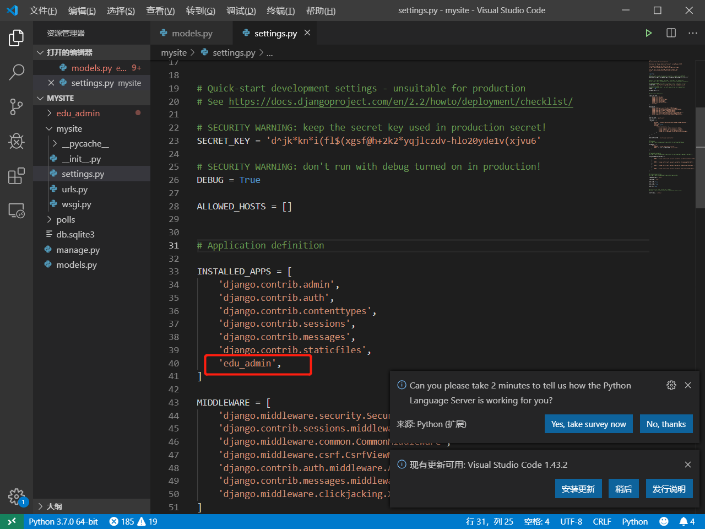
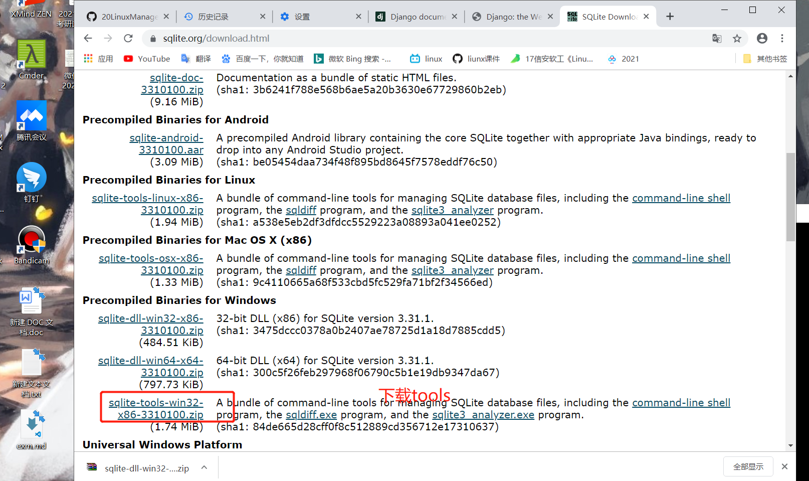

# SQL注入
## Diango        
1. 安装                       
```bash 
python -m pip install --upgrade pip
pip install Django
```
2. 构建了一个基于Django的基本框架的web应用程序。
```bash
cd D:\YearJunior2\SoftwareAndSystemSecurity

django-admin startproject mysite

cd  mysite

python manage.py startapp polls

python manage.py runserver

```               
                             
3. 访问 http://127.0.0.1:8000/              
                              
4. 在命令行里，可以看到服务器的打印输出，表示服务器收到了 request。看到的页面就是框架自动返回给大家的response.说明，request和response，请求相应的处理过程已经搭建起来了。
                              
5. 编写大型程序的时候，一定要做到mvc分离，m数据模型，我们要先建立基础的底层的数据结构。然后在处理用户输入，构建每个用户输入对应的处理函数。就是c 控制。然后，在底层m数据模型的基础上，绘制用户界面。比如写贪吃蛇游戏，最先做的事情，使用链表来保存蛇和食物的相应的数据，写一些处理这个数据的函数，供上层的c和v来调用。我们把这个叫做封装。
        
6. 大到一个复杂的大型web程序，其实底层思想还是mvc。只是换了个名字，叫mvt，t是页面模板。
7. 写Django的程序，或者任何框架程序。主要就是写三大部分，第一，数据模型，models，第二，views和url。是用户请求对应的处理程序。第三，前端页面模板。处理完的结果如何显示的问题。
8. 其中url部分，又称为路由。是把用户请求的url，对应到处理函数的过程。Django的处理函数，有一个专门名称，叫views。其基本过程就是框架收到用户的request ，其中有URL。框架根据urls.py中的配置。将用户请求对应到一个处理函数。一般在views.py中。views.py中的函数，参数就是request对象，Django中是HttpRequest类。然后views函数需要返回一个HTTPResponse类型的request。Django把这个reqeust变化为http协议的request数据包，返回给浏览器。一般在views的处理过程中，会访问数据库，也就是models。
9. models把底层的数据库操作，比如sql全部封装为了对象化的处理。比如底层操作数据库是用sql语句，这个大家在数据的课程中学习过。所以我们最原始的web程序，一般会程序员拼装sql语句。但是在Django中不用。我们把这种底层数据的封装，称为orm（Object-relational Mapper）
10. 现在我们使用的数据库分两种，一种叫关系型数据库，一种叫非关系型数据库。其中教务系统这种信息管理类的软件，一般是使用关系型数据库。关系型数据库的基本结构是表。那如何体现“关系”呢？关系其实是指表与表之间的关系。
11. 程序员只需要写好这个models.py文件。所有的建表的操作框架就可以完成。
12. 再建一个app ，比如叫 edu_admin
```bash
cd D:\YearJunior2\SoftwareAndSystemSecurity\mysite
python manage.py startapp edu_admin
code . #用vscode打开工程
```
然后在 edu_admin的models.py文件        
```python
from django.db import models
from django.contrib.auth.models import AbstractUser

class Course(models.Model):
    name = models.CharField(verbose_name='课程名',  max_length=100)
    number = models.IntegerField(verbose_name='编号', default=0)
    summary = models.CharField(verbose_name='摘要', max_length=500, null=True)


class Student(models.Model):
    class_name = models.CharField(verbose_name="班级", max_length=100, blank=True, null=True)
    name = models.CharField(verbose_name="姓名", max_length=100, blank=True, null=True)
    number = models.IntegerField(verbose_name="学号", default=0)
    phone_number = models.CharField(verbose_name='手机号', max_length=11,null=True)

class Score(models.Model):
    course = models.ForeignKey(Course, verbose_name='课程', on_delete=models.CASCADE, related_name='students')
    student = models.ForeignKey(Student, verbose_name='学生', on_delete=models.CASCADE, related_name='my_courses')
    score = models.FloatField(verbose_name='成绩',  null=True)

```
13. 表中的每个记录，都有一个唯一的编号，称为主键。而外键是其他表中主键记录。通常我们用外键来记录表和表的关系。成绩，是学生与课程的“关系”.所以成绩表需要记录的就是某学生某门课的分数。那学生和课程都有专门的表来记录。我们无需在成绩表中重复记录多余的信息，只需记录id.这个其他表中主键id，就是外键。而每个表中的主键，这里没有明确说明。系统会自动增加一个id字段。
14. 需要把这个表结构，真实的写入到数据库中。也就是create table的过程。django称为migrate。打开 mysite的settings.py。在  INSTALLED_APPS 这里增加一个 edu_admin，表示 edu_admin 这个是我们这个site的一个app.之前startapp命令只是创建了app，必须要把app写入到这里，这个app才会被纳入到站点功能中。             
                             
15. 生成db.sqlite3
```
python .\manage.py makemigrations
python .\manage.py migrate
```
                              
然后会出现一个 db.sqlite3             
                         
文件，数据库表结构就建立完成了             
makemigrations成功的标志是在app的目录下有migrations目录
                              
16. Django这里默认使用了sqlite这种简单的文件型数据库,这种数据库的好处是不用按照，就是一个文件来保存数据的所有信息，适合轻量级小规模的应用。但是效率和容量都有效。一般用在开发调试环境，不用在生产环境。
17. 为了验证Django真的建立了表，我们去下载一个[sqlite的客户端软件](https://www.sqlite.org/download.html)，来看一下它的表结构。下好后加到环境变量里面（记得重新打开cmd）或者或者放在db.sqlite同一个目录                                         
                             
18. 查看表
```bash
cd D:\YearJunior2\SoftwareAndSystemSecurity\mysite

sqlite3.exe db.sqlite3

. table #可以看到所有的表
```                                     
                              
19. 执行sql语句，插入一条记录
```sql
insert into edu_admin_course values (1,"课程1",1,"课程1的说明");

select * from edu_admin_course;
```                     
                             

## 参考资料
* [sqlite的客户端软件](https://www.sqlite.org/download.html)