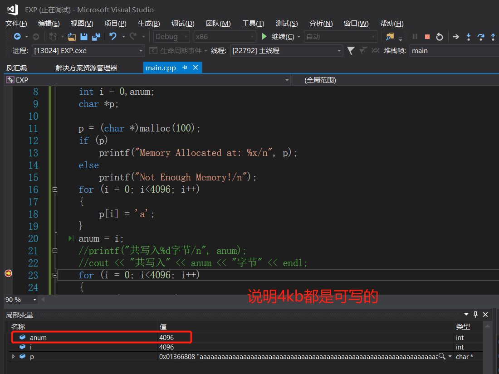
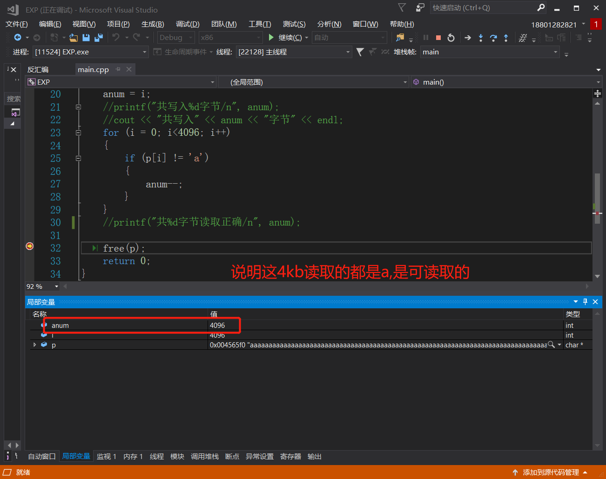
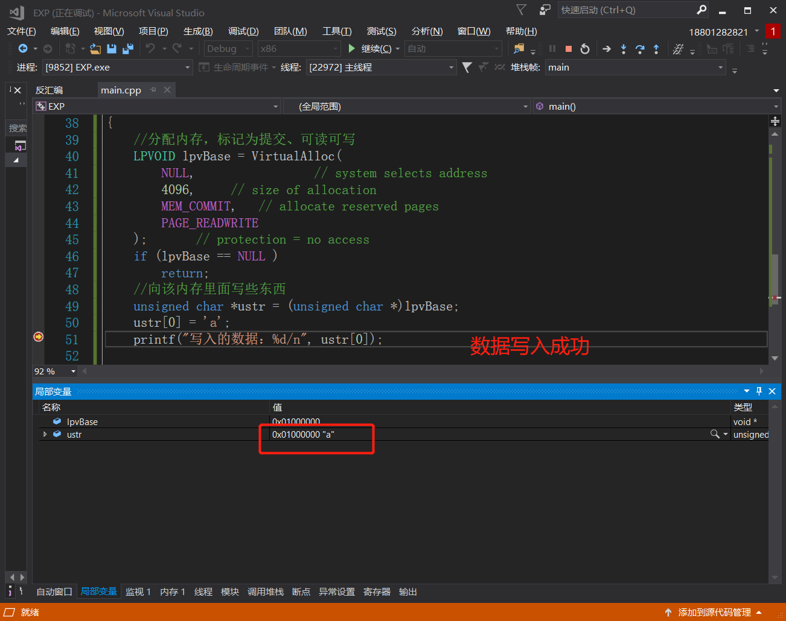
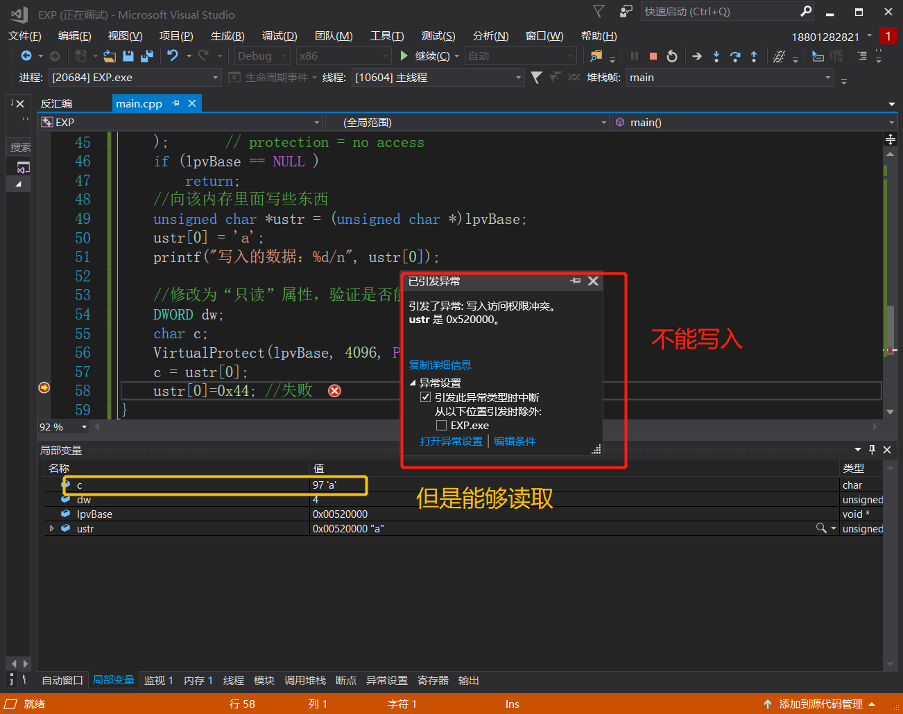
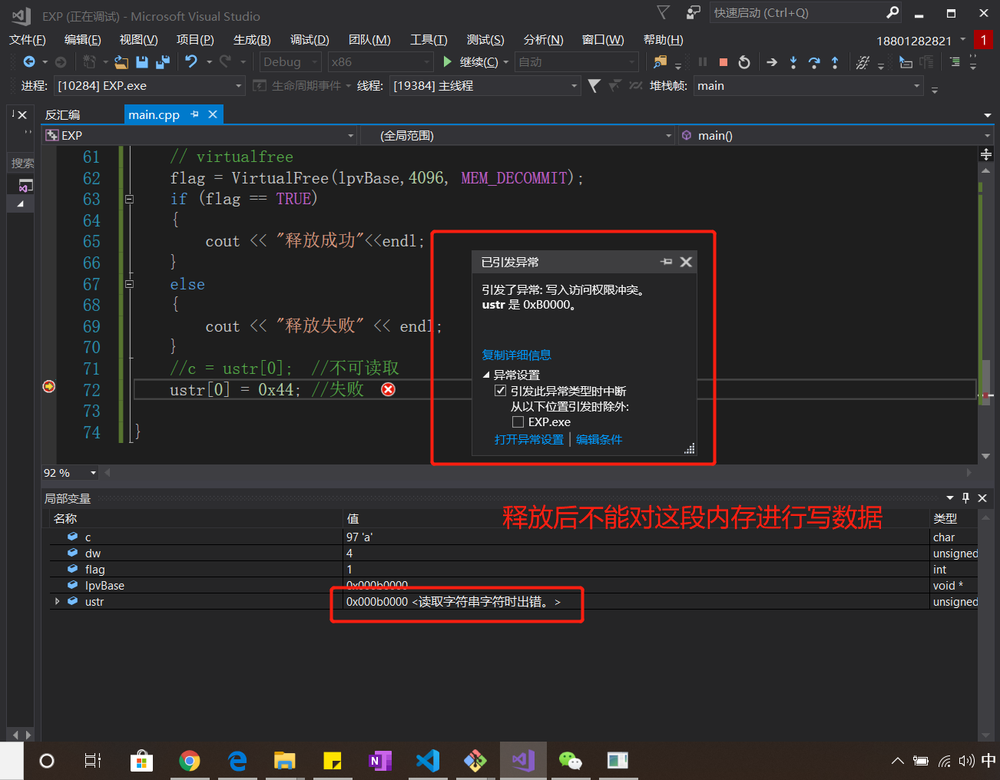

# 内存管理
>解答为什么一段内存不可读了，为什么有不可访问的内存地址。为什么有的时候会有执行异常等等这些问题
几乎所有的二进制安全漏洞，必然和内存有关系
## 缓冲区溢出
1. 在使用C、C++编写的原生应用程序。CPU在执行时会有一个栈的结构。这个栈的结构是程序执行过程中，与程序当前运行的所处的位置密切相关的。因此程序基本的组织单元是函数，函数的调用、返回等等是基本的操作。一个大型的程序，会形成一个函数调用关系图。
2. 栈，实际上是CPU用来记录当前执行到哪个函数的这个一个数据结构。所有每次函数调用会入栈一些东西，函数调用返回会出栈一些东西。由于栈和函数的这种一一对应，所以在设计的时候，直接把与函数密切相关的局部变量和参数也顺便保存在了栈中。如果局部变量的写入超过了预先分配的长度，就会覆盖其他数据。栈中的数据有与执行流程相关的，例如函数执行返回地址等。如果覆盖，就会造成执行流程的异常。
## 内存管理实例
1. 代码
```c
int main() 
{
 char* a = malloc(100);
 a[101] = 'a';
}
```
1. 这段代码，在执行的时候。不会有异常情况。程序能够正常退出。原因在于，操作系统对内存的管理，也是有开销的。系统本身需要在一块单独的系统内存中记录那些内存是可用的，那些内存是不可用的。如果记录内存是否可用这个信息太细，那么记录所有的内存开销就很高。比如，如果我们记录详细到每一个bit是否可用。如果系统的内存有1GB，记录内存是否可用的内存也需要1GB。这个开销有点太大了。所以，实际上，没有记录到这么细。在Windows系统中，通常是以4MB为单位进行管理的。也就是要么这4MB都可用，要么都不可用。这样，所需要的管理数据就小得多。
2. 虽然我们只分配了100个字节。但是这100个字节所在的整个4KB的内存全部是可用的
3. 每个4KB的内存分页，其实有三个属性，可读可写可执行。
## [Microsoft VirtualAlloc function](https://docs.microsoft.com/en-us/windows/win32/api/memoryapi/nf-memoryapi-virtualalloc)              
>malloc还不是最底层的内存管理方式
1. malloc—— 堆内存管理
2. malloc可以分配任意大小的数据，但是，malloc并不管理一块数据是否有效的问题。而是由更底层的虚拟内存管理来进行的。一个4KB的内存管理单元，我们称为一个内存分页。当malloc在内存分配时，如果已经可用的分页中，还有剩余的空间足够用，那么malloc就在这个可用的分页中拿出需要的内存空间，返回地址。如果已经可用的分页不够用，再去分配新的分页。然后返回可用的地址。
3. 在任务管理器中，切换到详细信息页面,每个进程的内存占用全部都是4KB的倍数                                  
                             
4. 这两个小实验，证明了，系统确实以4KB作为单元在管理内存，要么4KB全部有效，要么全部无效。
## [Memory Protection Constants](https://docs.microsoft.com/zh-cn/windows/win32/memory/memory-protection-constants)                       
> 用VirtualProtect 函数改变一块内存的访问属性。
1. 虚拟内管管理，系统也提供了一些的函数来让应用程序可以自己管理。
2. 分配内存是用 VirtualAlloc，释放使用VirtualFree，修改属性使用 VirtualProtec
3. 只要是VirtualAlloc分配的内存就可以使用。VirtualAlloc甚至可以指定希望将内存分配在哪个地址上。
4. malloc函数底层也会调用VirtualAlloc函数。当没有足够的整页的的内存可用时，malloc会调用VirtualAlloc
-----
# 课外实验
## 实验要求
1. 阅读[VirtualAlloc](https://docs.microsoft.com/en-us/windows/win32/api/memoryapi/nf-memoryapi-virtualalloc)、[VirtualFree](https://docs.microsoft.com/en-us/windows/win32/api/memoryapi/nf-memoryapi-virtualfree)、[VirtualProtect](https://docs.microsoft.com/en-us/windows/win32/api/memoryapi/nf-memoryapi-virtualprotect)等函数的官方文档。
2. 编程使用malloc分配一段内存，测试是否这段内存所在的整个4KB都可以写入读取。
3. 使用VirtualAlloc分配一段，可读可写的内存，写入内存，然后将这段内存改为只读，再读数据和写数据，看是否会有异常情况。然后VirtualFree这段内存，再测试对这段内存的读写释放正常。
## 实验过程
### [VirtualAlloc](https://docs.microsoft.com/en-us/windows/win32/api/memoryapi/nf-memoryapi-virtualalloc)
1. 在调用进程的虚拟地址空间中保留，提交或更改页面区域的状态。此功能分配的内存将自动初始化为零。
2. 语法
```cpp
LPVOID VirtualAlloc(
  LPVOID lpAddress, //要分配的区域的起始地址
  SIZE_T dwSize, //区域的大小，以字节为单位。如果lpAddress参数为 NULL，那么此值将四舍五入到下一页的边界
  DWORD  flAllocationType, //内存分配的类型
  DWORD  flProtect //对要分配的页面区域的内存保护
);
```
* 这个函数可以用来对虚拟地址空间进行分配(保留操作MEM_RESERVE) 
* 这个函数可以把已经保留的虚拟地址提交到物理存储器(MEM_COMMIT) 
* 这个函数可以使RAM上的内容无效(MEM_RESET)
### [VirtualFree](https://docs.microsoft.com/en-us/windows/win32/api/memoryapi/nf-memoryapi-virtualfree)
1. VirtualFree该函数的功能是取消或者释放调用进程的虚地址空间页的一个区域，如果想释放一块调用VirtualAllocEx函数分配的内存(包括虚拟内存),就使用VirtualFreeEx函数。
2. 语法
```cpp
BOOL VirtualFree(
LPVOID lpAddress, // 区域地址
SIZE_T dwSize, // 区域大小，字节
DWORD dwFreeType // 类型
);
```
### [VirtualProtect](https://docs.microsoft.com/en-us/windows/win32/api/memoryapi/nf-memoryapi-virtualprotect)
1. 在调用进程的虚拟地址空间中更改已提交页面区域的保护。
2. 语法
```cpp
BOOL VirtualProtect(
  LPVOID lpAddress,  //指针的地址，它描述要更改其访问保护属性的页面区域的起始页面。
  SIZE_T dwSize, //要更改其访问保护属性的区域的大小，以字节为单位
  DWORD  flNewProtect, //内存保护选项。
  PDWORD lpflOldProtect //指向变量的指针，该变量接收页面的指定区域中第一页的先前访问保护值。如果此参数为NULL或未指向有效变量，则函数将失败。
);
```
3. 如果函数成功，则返回值为非零。如果函数失败，则返回值为零。

### malloc分配一段内存
>编程使用malloc分配一段内存，测试是否这段内存所在的整个4KB都可以写入读取
1. 原型：`extern void *malloc(unsigned int num_bytes);`
2. 头文件：`#include <malloc.h>` 或 `#include <alloc.h>` (注意：alloc.h 与 malloc.h 的内容是完全一致的。)
3. 功能：分配长度为num_bytes字节的内存块。说明：如果分配成功则返回指向被分配内存的指针，否则返回空指针NULL。当内存不再使用时，应使用free()函数将内存块释放。
4. 一个char占1字节,4kb是4096个字节。但是分配时只分配100个字节
```cpp
#include<stdio.h>
#include<malloc.h>
#include<string>
using namespace std;
#include<iostream>
int main()
{
	int i = 0,anum;
	char *p;

	p = (char *)malloc(100);  //只分配100个字节的空间
	if (p)
		printf("Memory Allocated at: %x/n", p);
	else
		printf("Not Enough Memory!/n");
	for (i = 0; i<4096; i++)
	{
		p[i] = 'a';
	}
	anum = i;
	//printf("共写入%d字节/n", anum);
	//cout << "共写入" << anum << "字节" << endl;
	for (i = 0; i<4096; i++)
	{
		if (p[i] != 'a')
		{
			anum--;
		}
	}
	//printf("共%d字节读取正确/n", anum);
	
	free(p);
	return 0;
}
```
5. 4kb的数据都是可写的                            
                                      
6. 4kb读取的都是a,是可读取的                
                                      

### VirtualAlloc分配一段内存
>使用VirtualAlloc分配一段，可读可写的内存，写入内存，然后将这段内存改为只读，再读数据和写数据，看是否会有异常情况。然后VirtualFree这段内存，再测试对这段内存的读写释放正常。
1. 分配一段可读可写的内存，写入内存
```cpp
#include <windows.h>
void main()
{
	//分配内存，标记为提交、可读可写 
	LPVOID lpvBase = VirtualAlloc(
		NULL,                 // system selects address
		4096,     // size of allocation
		MEM_COMMIT,   // allocate reserved pages
		PAGE_READWRITE
	);       // protection = no access   
	if (lpvBase == NULL )   
		return;
	//向该内存里面写些东西
	unsigned char *ustr = (unsigned char *)lpvBase;
	ustr[0] = 'a';
	printf("写入的数据：%d/n", ustr[0]);
	
}
```
                                      
2. 将这段内存改为只读，再读数据和写数据
```cpp
void main()
{
	//分配内存，标记为提交、可读可写 
	LPVOID lpvBase = VirtualAlloc(
		NULL,                 // system selects address
		4096,     // size of allocation
		MEM_COMMIT,   // allocate reserved pages
		PAGE_READWRITE
	);       // protection = no access   
	if (lpvBase == NULL )   
		return;
	//向该内存里面写些东西
	unsigned char *ustr = (unsigned char *)lpvBase;
	ustr[0] = 'a';
	printf("写入的数据：%d/n", ustr[0]);
	
	//修改为“只读”属性，验证是否能写入
	DWORD dw;
	char c;
	VirtualProtect(lpvBase, 4096, PAGE_READONLY, &dw);
	c = ustr[0];  //可以读取
	ustr[0]=0x44; //失败
}
```
                                      
3. VirtualFree这段内存，再测试对这段内存的读写释放正常
```cpp
void main()
{
	BOOL flag;
	//分配内存，标记为提交、可读可写 
	LPVOID lpvBase = VirtualAlloc(
		NULL,                 // system selects address
		4096,     // size of allocation
		MEM_COMMIT,   // allocate reserved pages
		PAGE_READWRITE
	);       // protection = no access   
	if (lpvBase == NULL )   
		return;
	//向该内存里面写些东西
	unsigned char *ustr = (unsigned char *)lpvBase;
	ustr[0] = 'a';
	//printf("写入的数据：%d/n", ustr[0]);
	
	//修改为“只读”属性，验证是否能写入
	DWORD dw;
	char c;
	VirtualProtect(lpvBase, 4096, PAGE_READONLY, &dw);
	c = ustr[0];  //可以读取
	//ustr[0]=0x44; //失败

	// virtualfree
	flag = VirtualFree(lpvBase,4096, MEM_DECOMMIT);
	if (flag == TRUE)
	{
		cout << "释放成功"<<endl;
	}
	else
	{
		cout << "释放失败" << endl;
	}
	//c = ustr[0];  //不可读取
	ustr[0] = 0x44; //失败

}
```
* 能够成功释放                    
                                      
* 释放后是不能对这段内存进行读取                         
                               
* 释放后不能对这段内存进行写数据                                
                                      
## 实验结论
1. 系统对内存的分配和调用其实并没有想象中的那么琐碎。它和学校的管理方式是类似的，进行学生管理时并不是说一个学生一个学生地去进行管理，而是以班为单位去进行管理
2. 内存的分配与释放就有点像大学期间借教室，教学楼里的教师就像内存，你需要用的时候就得像老师申请借教室，这也就是alloc,分配。当你使用完后，这个教室被释放，就相当于你借的期限到了，你就不能再次使用那间教室，那间教室很有可能被其他的同学借走了
## 参考资料
* [VirtualAlloc](https://docs.microsoft.com/en-us/windows/win32/api/memoryapi/nf-memoryapi-virtualalloc)
* [VirtualFree](https://docs.microsoft.com/en-us/windows/win32/api/memoryapi/nf-memoryapi-virtualfree)
* [VirtualProtect](https://docs.microsoft.com/en-us/windows/win32/api/memoryapi/nf-memoryapi-virtualprotect)
* [字节、字、bit、byte的关系](https://blog.csdn.net/wanlixingzhe/article/details/7107923)
* [malloc函数详解](https://blog.csdn.net/xw13106209/article/details/4962479)
* [使用VirtualAlloc()创建虚拟内存，修改可读、可写属性](https://blog.csdn.net/dijkstar/article/details/1686965)
