主讲师：范文庆
# 软件与系统安全
> [课程网站](http://programtrace.com/)
# 第一节课（2020.3.11）
## 序言
* 其实软件安全就是三方面的问题：
    1. 一是有什么安全问题，安全问题产生的原因   
        * 第一种，二进制方面，主要是内存相关问题和逻辑错误问题。前一种有明确的机制，比如缓冲区溢出，空指针，格式化字符串。而逻辑错误就多种多样了。
        * 第二个问题。Web方面，典型的安全问题，有XSS、SQL注入等。非典型的问题就很多了。主要是一些代码的逻辑错误，每个漏洞都可能有不同的原理。
    2. 二是如何去发现问题。也就是漏洞挖掘技术。这里面分为白盒分析和黑盒分析两大点。
        * 所谓白盒分析，就是通过分析软件的源代码去寻找问题。这里面，有手工代码分析，就是我们的软件测试技术，和代码review。但是软件的源代码通常比较庞大，手工分析起来很费劲。所以，又有人研究如何自动化的分析代码。典型的技术呢，就是符号执行。白盒分析，数据量很大，需要投入很多人工。
        * 和白盒分析向对立的一种技术，黑盒分析发展起来。那黑盒分析，顾名思义，就是完全不管软件的内部机理，不去看源码，把需要分析的软件当做一个黑盒子。看不见，或者根本不去看内部。不看内部怎么分析呢？看表面现象。对软件来说，就是看输入和输出。给它什么样的输入，得到什么样的输出，再去猜测他内部的机制。黑盒分析法，典型的就是Fuzzing技术，中文叫模糊测试。
    3. 三是如果有人利用这这些安全问题，如何防御
        * 补丁。通过漏洞数据库来披露和管理各种漏洞，厂家有义务定期发布软件补丁或者更新，软件用户应该及时升级软件。第三方人员，如果发现了安全问题，应该通报给厂家，而不是在漏洞修补以前，去利用漏洞搞破坏，或者不负责任的披露漏洞。
        * 防御机制。如何去寻找记录攻击的痕迹，然后分析这些数据。数据的来源又分为了 主机层面 网络层面，这就是我们入侵防御系统所做的事情。
        * 攻击的人会进行伪装，不让防御的人那么容易发现，攻击者可能会做哪些方面的伪装，常用的伪装技术有哪些，如何去对抗伪装。这方面，典型的技术就是加壳脱壳技术，和Rootkit技术。

## 缓冲区溢出和XSS
* 这两个呢，也代表了二进制软件和脚本软件（包括绝大多数Web软件都是脚本软件开发的）两大技术方向。
* 二进制软件和脚本软件的区别:
    * 计算机的底层，是CPU直接执行在内存中的机器指令，C和C++这类编程语言开发的软件，有一个过程，叫编译链接，其实就是为了把程序变成CPU可以直接执行的二进制指令。
    * 这类软件的一个特点，就是需要直接操作内存。内存是所有在运行态的软件及其数据保存的地方。内存分为细小的单元，每个单元有一个唯一的地址。所有要访问数据，必须知道数据的地址，要保存新的数据，就必须分配内存，获得可用的地址。那么地址也是数，如果搞不好，不小心，计算错误了。那么就会访问到不该访问的数据，就会造成数据的泄露或者破坏。这就是二进制软件安全问题的根源。
    * 二进制程序的编程，有很大的难度，就在于CPU之能做出这样了，他是电路，是物理的东西，不可能设计得机制太复杂。
    * 使用C语言和C++就不可避免的一个东西：直接操作内存，也就是指针
    * 然后在C和C++发展成熟以后，就有人去研究如何降低编程的难度，可不可以避免程序员编程时直接操作内存，把需要操作内存的地方，都封装起来。屏蔽在编程语言的内部。就发明了脚本语言。脚本语言，是干脆用C和C++这样的二进制程序开一个软件来执行一种新的程序。也就是用软件来模拟CPU工作。但是软件的可定制性比CPU就高多了，可以想定义什么指令就定义什么指令。把所有需要操作内存的东西，全部封闭在执行器内部，只给程序员接口，不给程序员操作内存的机会。这就是对象。比如把字符串封装为string对象。只能调用string.len()这样的方法来操作这个对象。所有大家看到python java js这样的程序，都有一个二进制程序的执行器。比如python.exe java.exe Web浏览器等。这些脚本程序的执行器，都是二进制程序。但是，虽然这些脚本程序没有了内存相关问题，有引出了其他的问题。
    * 比如XSS的问题。就是web程序，存在一种高交互性。web是互联网时代的软件的基本框架，所有一定会有用户提交数据。当初为了网页动态的需求，开发了网页的前端脚本，比如js。直接把脚本嵌入到网页中。浏览器只要发现了script标签，就去当做脚本来执行。把网页按照程序员的定制，变的丰富多彩，变得富于变化。但是，恰恰另外一种需求，就是UGC软件，所谓用户产生内容。也就是网页的内容来至于用户提交的内容，这种软件已经非常常见了。比如BBS、博客、微博，电商视频网站的用户评论，都会涉及到用户提交的内容在页面上呈现。这两种机制，放在一起就产生了神奇的效果。当用户提交的内容里含有脚本呢？如果直接将用户提交的内容放在页面上，那么用户提交的内容中的脚本会不会被浏览器解析执行呢？那么一个用户提交了一个脚本就可以在这个页面的所有用户主机上执行呢？用户能提交程序执行了，怎么才能不保证这个程序不是恶意的呢？要知道，前端脚本，除了渲染页面元素这样的功能，还有获得用户的输入跳转页面到其他地址等等丰富的功能。只有能执行，就能干很多事情。

## 实验
1. 首先，你需要学习编写一个简单的html文件，这个文件只要有一个表单，用户就可以在表单中输入数据，向服务器提交。
```html
<html>
<body>
<form method="post">
        <input type="text">
        <button>提交</button>
      </form>
</body>
</html>
```
2. 搭建一个web服务器，如果这个html是放在web服务器上，用户输入了数据，点击提交，浏览器就会把编辑框中的数据封装为一个POST请求，发现服务器。服务器会把这个数据发给后端脚本来处理。可以通过定义 from的属性来指明需要哪个脚本文件来处理。比如PHP程序，他有一个POST超级变量，当用户提交了数据以后，对应的php脚本的post变量就是用户提交的数据。
3. 假设服务器现在把用户提交的数据放在user_input.html的body标签中。然后保存在服务器文件的根目录中。当有网站的用户访问 http://xxxx.com/user_input.html 的时候。就会看到刚才哪个表单用户提交的内容。当然实际的情况是这两个用户可能不是同一个用户，于是A用户提交的内容B用户就访问到了。当然实际的情况是这两个用户可能不是同一个用户，于是A用户提交的内容B用户就访问到了。既然能执行alert函数，就能执行其他功能，比如给 window.location.href赋值，让用户莫名其妙的跳转到另外一个网站。
4. 最简单的实验环境，就是在vscode中，安装一个php插件，然后编写一个简单的php脚本，调试运行这个脚本。F5 vscode会自动选择脚本运行的方式 ，把用户的表单输入写入到html文件。在通过浏览器访问这个文件html文件，这就是一个最简单的xss运行环境了。
5. 编码方式:head标签里通过meta指定
6. 延用上学期的实验，用apache服务器来完成的                 
                 
               

# 第二节课（2020.3.18）
> 本节课主要是代码讲解
## 实验
1. vscode调试httpserver.py文件后，会生成一个launch.json        
2. 代码跑起来以后，就可以在浏览器中访问 http://127.0.0.1:8080/a.html                     
                             

## httpserver.py
```python
# -*- coding: utf-8 -*-

import sys
import cgi
from http.server import HTTPServer, BaseHTTPRequestHandler

# 是整个代码的主体，也是出问题的地方
class MyHTTPRequestHandler(BaseHTTPRequestHandler): # 这个是 HTTPServer 的回调,用来处理到达的请求。
    field_name = 'a'  #这里的表单是使用的post方法提交数据。
    form_html = \   
        '''
        <html>
        <body>
        <form method='post' enctype='multipart/form-data'> 
        <input type='text' name='%s'>
        <input type='submit'>
        </form>
        </body>
        </html>
        ''' % field_name

    def do_GET(self):
        self.send_response(200)
        self.send_header("Content-type", "text/html")
        self.end_headers()
        try:
            file = open("."+self.path, "rb")  # self.path 是这个请求的路径
        except FileNotFoundError as e:
            print(e)
            self.wfile.write(self.form_html.encode())
        else:
            content = file.read()
            self.wfile.write(content)

    def do_POST(self):
        form_data = cgi.FieldStorage(          #解析了客户端提交的请求，将form组织为python的dict数据类型
            fp=self.rfile,
            headers=self.headers,                    # 原始的请求的头部
            environ={
                'REQUEST_METHOD': 'POST',
                'CONTENT_TYPE': self.headers['Content-Type'],
            })
        fields = form_data.keys()
        if self.field_name in fields:  # 处理了用户提交，写入文件
            input_data = form_data[self.field_name].value   #就是你在编辑框中填入的数据
            file = open("."+self.path, "wb")
            file.write(input_data.encode())

        self.send_response(200)
        self.send_header("Content-type", "text/html")
        self.end_headers()
        self.wfile.write(b"<html><body>OK</body></html>")


class MyHTTPServer(HTTPServer): # MyHTTPServer类，是继承自原生的HTTPSever
    def __init__(self, host, port):
        print("run app server by python!")
        # 指定了 MyHTTPRequestHandler 来处理 http请求，那么当用get方法请求，就会调用 do_GET,POST方法请求，就会调用 do_POST函数
        HTTPServer.__init__(self,  (host, port), MyHTTPRequestHandler)


if '__main__' == __name__:
    server_ip = "0.0.0.0"
    server_port = 8080
    if len(sys.argv) == 2:
        server_port = int(sys.argv[1])
    if len(sys.argv) == 3:
        server_ip = sys.argv[1]
        server_port = int(sys.argv[2])
    print("App server is running on http://%s:%s " % (server_ip, server_port))

    server = MyHTTPServer(server_ip, server_port)
    server.serve_forever()

```
1. 这个是使用python原生的cgi和http.server两个库运行的一个简单的http服务器程序。因为没有使用第三方库，所有不需要使用pip安装依赖。运行比较简单。
2. HTTPServer：重写了 ```init```函数，增加了打印输出语言，然后字节调用父类的 ```init``` 传递了服务器运行需要的地址 端口 等参数。我们的监听地址和端口是 0.0.0.0:8080。
3. MyHTTPRequestHandler 类，这个是 HTTPServer 的回调,MyHTTPRequestHandler 类，这个是 HTTPServer 的回调。也就是0.0.0.0:8080 上有任何的HTTP请求到达时，都会调用 MyHTTPRequestHandler来处理。MyHTTPRequestHandler 直接 继承自 BaseHTTPRequestHandler，其中 BaseHTTPRequestHandler 的 do_GET和do_POST两个方法被重写。
4. [http请求的方法](https://developer.mozilla.org/en-US/docs/Web/HTTP/Methods)中.http请求有如下这么多种methods，但是我们通常使用得最多的，是GET和POST。比如，大家直接在浏览器中输入链接，浏览器拿到地址以后，默认是采用GET方式向服务器发送请求。所以GET方式最常见。
5. 所以通常来说，从服务器获取数据，使用get方面，向服务器提交数据，使用post方法。
6. 在 python 的 BaseHTTPRequestHandler 类中 ，do_XXX函数，就是处理对应的客户端请求的函数。
7. 下断点，然后刷新浏览器，代码就会断点命中中断。                       
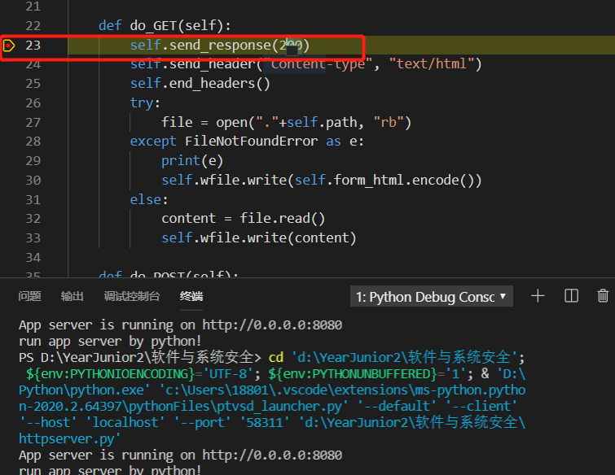                              
8. http://127.0.0.1:8080/a.html 其中 http://127.0.0.1:8080是协议服务器地址和端口。/a.html就是路径。
9. 通常，一个静态的http服务器，这里的路径就是http服务器根目录下的文件，动态服务器这里可能是文件和参数，或者是对应其他服务器后台的处理过程。
10. 例如 http://127.0.0.1:8080/a.php?p1=x 指定有a.php来处理这个请求，参数是p1=x，问号后面是参数，可以有多个。那么就去读 a.html文件，如果文件不存在，就返回404，也就是```self.send_response(200)```,200按照协议 应该是404。这里做了一个特殊的处理，如果指定的文件不存在，我还是返回200，表示请求路径是正确的，可以处理，然后返回一个默认的页面。这个页面就是 form_html的变量，在FileNotFoundError异常处理过程中写回
11. wfile和rfile对应http响应和请求的body部分。
12. GET处理完成以后，浏览器就拿到了 200 状态的 "Content-type"为"text/html"的 form_html
13. 打开浏览器的调试模式，到sources这个tab就看到了服务器向浏览器返回的数据，就是我们的form_html变量                 
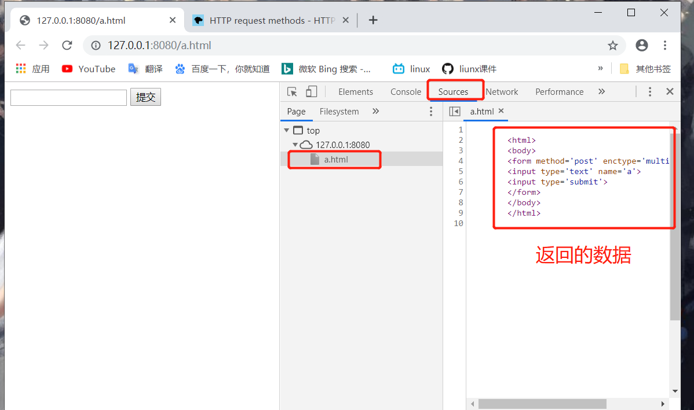                           
表单指定了使用post方式向服务器提交数据
14. network tab里可以看到完整的请求响应过程                  
                              
15. 在表单中填入数据。点提交按钮。然后服务器的do_POST函数回被调用。这里通过 cgi.FieldStorage解析了客户端提交的请求，原始的请求的头部在self.headers。body部分在self.rfile 
16. 提交框里填写123，执行完成后，你的目录下会多一个a.html，内容为123                 
                             
17. 再访问 http://127.0.0.1:8080/a.html 时，这个时候a.htm已经存在了所以是运行的do_GET(self)的else部分，直接把文件内容会写给浏览器 
18. 再访问一个不存在的页面，比如b.html，会出现那个默认的form
19. 在输入框输入```<html><body><script>alert('XSS')</script></form></body></html>```,这段内容就会被写入b.html                          
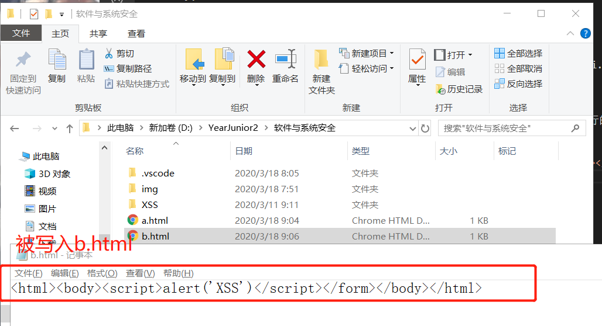                           
20. 再次访问b.html的时候，（不要刷新，刷新是重复上一次的POST请求，直接在地址栏里回车）整个页面被载入 script在浏览器上执行,出现弹窗           
                              
21. 理论上，任何的js都是可以被执行的。js可以实现非常丰富的功能。比如可以让你扫码支付。
22. 比如在 c.html里填入```<html><body><script>window.location.href='http://by.cuc.edu.cn'</script></form></body></html>```,下次再访问c.html的时候。页面跳转了这就是 window.location.href='http://by.cuc.edu.cn' 这段脚本的功能                   
                              
23. 在浏览器中访问 http://127.0.0.1:8080/httpserver.py ，在sources中，是我们的源代码。       
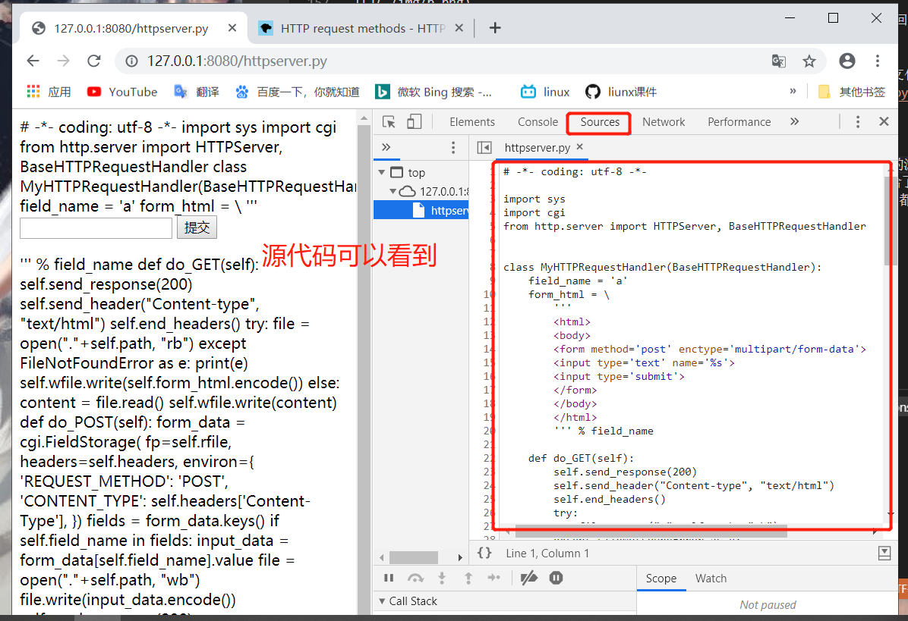                             
24. 由于服务器没有做任何过滤，只要是存在的文件，就发送给客户端，源代码文件也发送给了客户端。现在黑客可以知道我整个后台的逻辑了。如果还有一些配置文件，比如数据库地址和访问口令等，也都被泄露了。更严重的是，黑客甚至可以注入后端代码。
25. 由于我们是回写到文件，你可以构造一个http post请求，把httpserver.py文件改写了。但是构造这个请求用浏览器就不行了，需要采用curl等更基础的工具裸写post请求发送给服务器的
26. 到浏览器调试工具的 elements处，由于后台只处理名为a的表单项，所以我们需要把input的name改为a，**在做之前，记得把httpserver.py复制一份，要不然就没了**
                  
27. 然后输入框输入haha,httpserver.py，它变了
                              
28. 所以，我们甚至可以给后端注入代码。当然，如果只是注入一个hahaha 服务器就挂了。再也跑不起来了。所以，这是一个及其简单，但是漏洞百出的web服务器。这就是不做任何过滤，直接写入数据的危害。             

# 第三节课（2020.3.25） 
> web程序开发和web程序非常常见的一种漏洞，sql注入
## web程序的开发
1. 客户端（浏览器）和服务器要区分清楚
2. 用户使用浏览器访问服务器，服务器在云端，我们看不见，只有一个域名对应的IP地址。浏览器通过发送请求到服务器，服务器收到请求以后返回响应。这里面数据的发送和接受，底层是计算机网络的东西的工作。
3. 对web程序来说，主要关心就是这一收一发的过程，Requests and responses 
4. 在tcp数据包的payload部分是http协议数据包，又分为了headers和body等部分。发送的Request，最核心的部分是一个url。其中/前的部分，是主机地址，会被解析为ip地址。第一个/后的部分为路径和参数。会对应服务器上的文件或者功能。
5. 然后，服务器处理完毕了，返回response，而response一般是一个html格式的文本。浏览器，会直接把html渲染为我们所看到的页面的不同样式。html有自己专门的语法。又可以嵌入js和css，用来要求浏览器执行动态的效果，或者根据css的配置，对各种html的内部的标签和元素，显示不同的样式。html的格式是以标签树的结构组织的。
6. 为了方便web程序的开发，大家发明了一种开发web程序的基础架构。就是把web程序开发的一些底层的东西，已经处理好了。开发者只需要关注功能的构建就可以了。是现在主流的开发技术，称为框架。

## Diango        
1. 安装                       
```bash 
python -m pip install --upgrade pip
pip install Django
```
2. 构建了一个基于Django的基本框架的web应用程序。
```bash
cd D:\YearJunior2\SoftwareAndSystemSecurity

django-admin startproject mysite

cd  mysite

python manage.py startapp polls

python manage.py runserver

```               
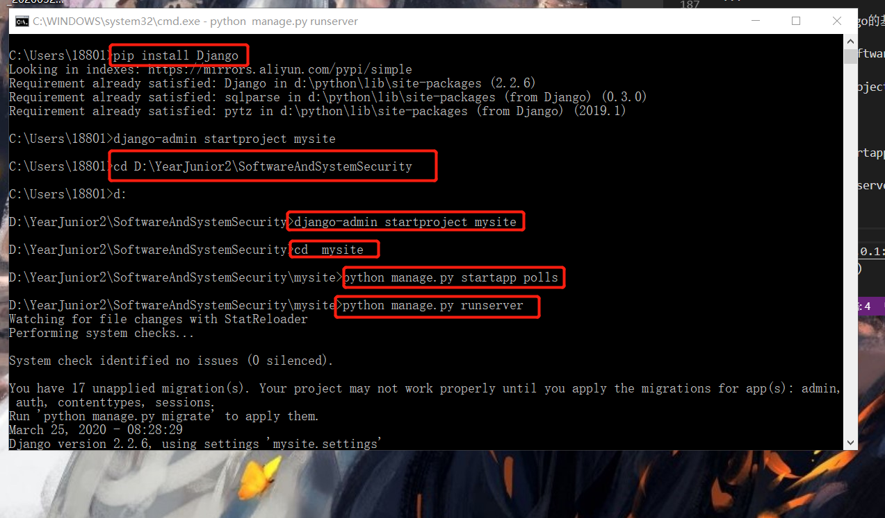                             
3. 访问 http://127.0.0.1:8000/              
                              
4. 在命令行里，可以看到服务器的打印输出，表示服务器收到了 request。看到的页面就是框架自动返回给大家的response.说明，request和response，请求相应的处理过程已经搭建起来了。
                              
5. 编写大型程序的时候，一定要做到mvc分离，m数据模型，我们要先建立基础的底层的数据结构。然后在处理用户输入，构建每个用户输入对应的处理函数。就是c 控制。然后，在底层m数据模型的基础上，绘制用户界面。比如写贪吃蛇游戏，最先做的事情，使用链表来保存蛇和食物的相应的数据，写一些处理这个数据的函数，供上层的c和v来调用。我们把这个叫做封装。
        
6. 大到一个复杂的大型web程序，其实底层思想还是mvc。只是换了个名字，叫mvt，t是页面模板。
7. 写Django的程序，或者任何框架程序。主要就是写三大部分，第一，数据模型，models，第二，views和url。是用户请求对应的处理程序。第三，前端页面模板。处理完的结果如何显示的问题。
8. 其中url部分，又称为路由。是把用户请求的url，对应到处理函数的过程。Django的处理函数，有一个专门名称，叫views。其基本过程就是框架收到用户的request ，其中有URL。框架根据urls.py中的配置。将用户请求对应到一个处理函数。一般在views.py中。views.py中的函数，参数就是request对象，Django中是HttpRequest类。然后views函数需要返回一个HTTPResponse类型的request。Django把这个reqeust变化为http协议的request数据包，返回给浏览器。一般在views的处理过程中，会访问数据库，也就是models。
9. models把底层的数据库操作，比如sql全部封装为了对象化的处理。比如底层操作数据库是用sql语句，这个大家在数据的课程中学习过。所以我们最原始的web程序，一般会程序员拼装sql语句。但是在Django中不用。我们把这种底层数据的封装，称为orm（Object-relational Mapper）
10. 现在我们使用的数据库分两种，一种叫关系型数据库，一种叫非关系型数据库。其中教务系统这种信息管理类的软件，一般是使用关系型数据库。关系型数据库的基本结构是表。那如何体现“关系”呢？关系其实是指表与表之间的关系。
11. 程序员只需要写好这个models.py文件。所有的建表的操作框架就可以完成。
12. 再建一个app ，比如叫 edu_admin
```bash
cd D:\YearJunior2\SoftwareAndSystemSecurity\mysite
python manage.py startapp edu_admin
code . #用vscode打开工程
```
然后在 edu_admin的models.py文件        
```python
from django.db import models
from django.contrib.auth.models import AbstractUser

class Course(models.Model):
    name = models.CharField(verbose_name='课程名',  max_length=100)
    number = models.IntegerField(verbose_name='编号', default=0)
    summary = models.CharField(verbose_name='摘要', max_length=500, null=True)


class Student(models.Model):
    class_name = models.CharField(verbose_name="班级", max_length=100, blank=True, null=True)
    name = models.CharField(verbose_name="姓名", max_length=100, blank=True, null=True)
    number = models.IntegerField(verbose_name="学号", default=0)
    phone_number = models.CharField(verbose_name='手机号', max_length=11,null=True)

class Score(models.Model):
    course = models.ForeignKey(Course, verbose_name='课程', on_delete=models.CASCADE, related_name='students')
    student = models.ForeignKey(Student, verbose_name='学生', on_delete=models.CASCADE, related_name='my_courses')
    score = models.FloatField(verbose_name='成绩',  null=True)

```
13. 表中的每个记录，都有一个唯一的编号，称为主键。而外键是其他表中主键记录。通常我们用外键来记录表和表的关系。成绩，是学生与课程的“关系”.所以成绩表需要记录的就是某学生某门课的分数。那学生和课程都有专门的表来记录。我们无需在成绩表中重复记录多余的信息，只需记录id.这个其他表中主键id，就是外键。而每个表中的主键，这里没有明确说明。系统会自动增加一个id字段。
14. 需要把这个表结构，真实的写入到数据库中。也就是create table的过程。django称为migrate。打开 mysite的settings.py。在  INSTALLED_APPS 这里增加一个 edu_admin，表示 edu_admin 这个是我们这个site的一个app.之前startapp命令只是创建了app，必须要把app写入到这里，这个app才会被纳入到站点功能中。             
                             
15. 生成db.sqlite3
```
python .\manage.py makemigrations
python .\manage.py migrate
```
                              
然后会出现一个 db.sqlite3             
                         
文件，数据库表结构就建立完成了             
makemigrations成功的标志是在app的目录下有migrations目录
                              
16. Django这里默认使用了sqlite这种简单的文件型数据库,这种数据库的好处是不用按照，就是一个文件来保存数据的所有信息，适合轻量级小规模的应用。但是效率和容量都有效。一般用在开发调试环境，不用在生产环境。
17. 为了验证Django真的建立了表，我们去下载一个[sqlite的客户端软件](https://www.sqlite.org/download.html)，来看一下它的表结构。下好后加到环境变量里面（记得重新打开cmd）或者或者放在db.sqlite同一个目录                                         
                             
18. 查看表
```bash
cd D:\YearJunior2\SoftwareAndSystemSecurity\mysite

sqlite3.exe db.sqlite3

. table #可以看到所有的表
```                                     
                              
19. 执行sql语句，插入一条记录
```sql
insert into edu_admin_course values (1,"课程1",1,"课程1的说明");

select * from edu_admin_course;
```                     
                             

## 作业
* 在不使用Django的情况下，我们可以使用更底层的pyhton的sqlite库来编程操作数据库。https://docs.python.org/3/library/sqlite3.html 。大家可以在上周的httpserver.py的基础上，继续编写漏洞。写两个页面，一个是教师录入成绩页面，一个是学生查询成绩页面。教师录入成绩页面表单有三个字段，课程id，学生id，成绩。录入提交以后，httpserver调用sqlite库使用sql语句写入数据库。然后是学生查询成绩表单，学生输入学生id，课程id，httpserver使用sql语句查询成绩后返回给用户。这里不需要做登录功能，课程也用直接输入id而不是下拉菜单的方式，或者其他选择的方式，而是直接输入id。为了体验最原始的web的开发过程。

# 第四节课（2020.4.1）
> 继续讲web程序设计和SQL注入

## 教务系统实验继续
1. 使用Django这种框架编程，第一步是定义模型，Django会自动把定义好的模型转化为数据库表结构。这种方式称为 ORM
2. 所以我们在models里定义了三个类，然后执行了生成migrations和migrate。数据库的表就建立完成，以后每次修改了models，都需要执行makemigrations和migrate。才能将修改结果对应到数据库中。
3. views是Django功能实现应用功能的地方。如果你想写一个动态的页面，就在views中定义一个函数。这是最基本的方法。在此基本的方法上还可以有高级的，系统内置的一些高级的数据库增删改查的方法。
4. 最基本的views函数，是收到一个HttpRequest类型的参数，需要返回一个HTTPResponse类型的返回值，和http协议对应。
5. 在edu_admin中的views.py写入一下内容
```python
from django.shortcuts import render
from django.http import HttpResponse

def index(request):

    return HttpResponse('<html><body>OK</body></html>')   # 一个基本的 “处理请求，返回响应”
    
# Create your views here.

```
6. 写好了以后，还没有结束。我们还需要把这个views，对应到一个路径上。也就是客户端如何调用这个views函数对应的功能。因为一个实用的web app只有一个views是不够的，可能有很多很多views.然后我们需要把这些views对应到不懂的url上。这样客户端才能访问。这个工作，是urls.py来完成的。
7. 在 edu_admin中建一个urls.py文件，写入如下内容
```python
from django.urls import path

from .views import *

urlpatterns = [
    path('index',index),
]
```
8. 然后需要再主urls.py，也就是 mysite的urls.py中包括这个url配置。添加`path('edu/', include('edu_admin.urls')),`
9. 运行
```bash
cd D:\YearJunior2\SoftwareAndSystemSecurity\mysite
python manage.py runserver
```         
10. 浏览器访问`http://127.0.0.1:8000/`                 
                              
11. 在访问`http://127.0.0.1:8000/edu/index`                     
                     
12. 如果这一步有，就说明我们 urls和views配合工作成功。用户在浏览器中输入路径，django把这个url对应到一个views函数上。views函数处理HttpRequest。返回HttpResponse。这个工作流程跑通.把url对应到一个views函数的过程，专业术语叫“路由”注意，这个路由不是路由器的那个路由。路由器的路由是IP层的IP数据包分发功能。注意一个url是可以带参数的。views函数也是可以带参数的。        
13. 完成动态页面。修改edu.min的urls.py 
```python
urlpatterns = [
    path('index/<int:pk>',index),
]
```
修改edu中的view.py    
```python
def index(request,pk):

    return HttpResponse('<html><body>hello world %d </body></html>' % pk)
    
```
14. 访问`http://127.0.0.1:8000/edu/index/10`         
                        
15. pk就是参数，而且只允许整数。路由系统会把这个参数赋值传递给views函数的pk参数。
16. 改一下edu的views.py
```python
from django.contrib.auth.decorators import login_required
from django.shortcuts import render

from django.http import HttpResponse

# 从models中导入模型类,然后调用这个模型类的objects的filter方法，就完成了一次sql select
from .models import Score 

def index(request,pk):
    return HttpResponse('<html><body>hello world %d </body></html>' % pk)

# Create your views here.

@login_required
def my_score(request):
    # filter函数的参数是就相当于查询的过滤条件
    # 要查询的是 student为当前登录用户的Score表的记录
    result=Score.objects.filter(student=request.user)
    return render(request,'score.html',{'result':result})
```
17. Django中，当前登录用户，就在request对象的user属性中。views写了还不够。我们还需要修改一下模型。Django是有默认的用户管理系统的。用户相关的数据库表结构其实Django已经建立好了.但是我们这里用了student表来作为系统用户。所以我们要告诉Django不要用系统默认的用户模型了，用Student.
18. 首先在edu的models.py中导入`from django.contrib.auth.models import AbstractUser`这个是Django默认的用户管理的数据库模型.AbstractUser已经有很多数据库字段了，比如密码肯定是需要以某种方式保存到数据库中的。这些字段 AbstractUser都有了。我们在AbstractUser的基础上，扩充几个我们要用的字段就可以了。
19. Student继承了AbstractUser。           
                             
告诉Django用Student作为系统用户管理的数据库模型。
20. 在mysite settings.py也就是整个站点的配置文件中，增加一条`AUTH_USER_MODEL='edu_admin.Student'`告诉Django，使用 edu_admin 的Student作为用户管理登录授权的模型。
21. 代码修改完以后。这里是不是涉及到数据库修改啊。所有要进行数据库表结构的migrate
```bash
python manage.py makemigrations 
python manage.py migrate
```
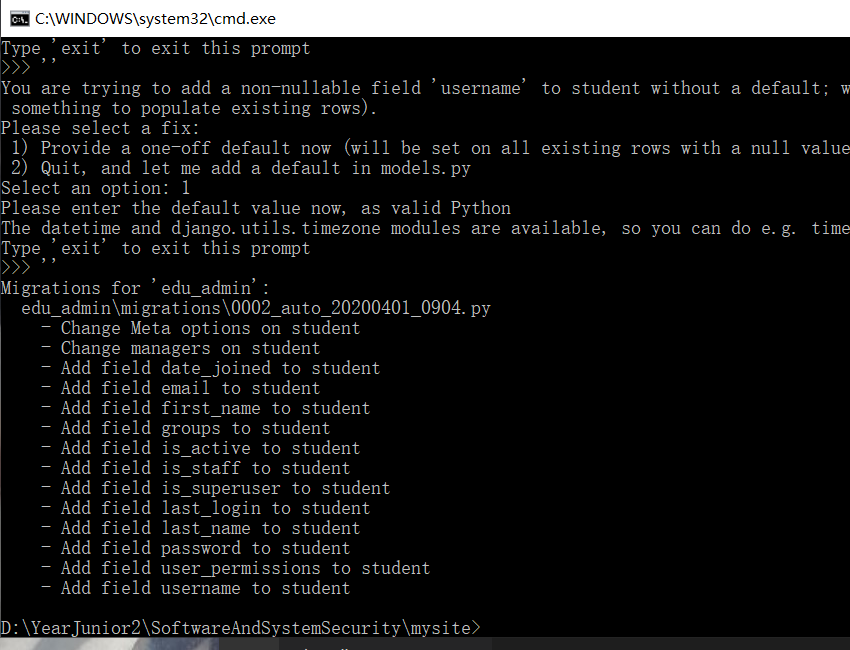                  
22. 下面，我们尝试在数据库中写入一些数据。然后测试看看Django的数据库访问是否正常。最原始的方法就是在sqlite.exe 中用sql语句插入。但是这个方法容易把数据搞乱了。  而且比如用户密码这样的东西，不是明文保存的。所有插入会有问题.我们用Django的方式，先建立一个超级用户，建立一个管理员账户。先删除db.sqlite3,再`python manage.py migrate`
```bash
python manage.py createsuperuser  
#admins
#0000
```
23. 建立好了以后，用sqlite3.exe可以看到Student表多了一条记录.然后我们可以用Django的admin功能，用超级管理员录入数据。Django的admin相当于一个数据管理的超级权限后台。可以直接操作数据库。在admin.py中录入以下内容。
```python
from django.contrib import admin

from .models import Student, Course, Score

class ScoreAdmin(admin.ModelAdmin):
    list_display=('course','score','student')

admin.site.register(Student)
admin.site.register(Course)
admin.site.register(Score,ScoreAdmin)
# Register your models here.
```
24. 访问 http://127.0.0.1:8000/admin/ 刚才新建的用户 登录后看到这个页面。可以录入一些课程，学生，和成绩了(一定先要有 课程 和 学生)。                   
                              
                             
25. 为了在admin管理的时候，直接显示课程名称，可以给course模型增加一个 __str__方法。这样所有course对象的str ，返回的是name字段。界面显示就是课程名称了。
                              
26. 当数据库有了值以后。我们就可以在view中验证，我们查询自己成绩的功能是否正常了。views中的@login_required表示需要登录。我们这里已经用超级管理员登录了，所以是可以访问的。
27. 然后说一下 render函数。render是一个Django内置的函数。用于在模板文件的基础上，通过渲染得到动态的网页效果。其中 score.html是模板,后面的{} dict是参数.render必须传参reqeust,然后render函数就会在模板html文件的基础上，生成一个html,并返回 HTTPResponse,所有可以直接作为 views函数的返回。
28. 那么还需要一个score.html.在edu下新建templates目录，下面新建score.html
```html
<html>
<body>

科目： {{ i.course.name }}
成绩： {{ i.score }}
<br>

</body>
</html>
```
这里的result 就是 render传入的result,对每一个result 显示其课程名和分数,大家看到这里的多表查询 (course表中的name）直接. 就调用出来了。模板语言的语法 {{ 变量名 }},很容易理解。
29. 写了新的views函数，需要增加url.在edu下的urls.py中添加
```python
urlpatterns = [
    path('index/<int:pk>',index),
    path('myscore',my_score)
]
```
30. 访问 http://127.0.0.1:8000/edu/myscore ，可以看到成绩                       
                              
31. 这就完成了当前登录用户（超级管理员 admin 同学）的成绩查询。注意，这里我们偷了一个懒，实际情况，并不是每个用户都是超级管理员。需要有普通用户登录注册页面。这个页面需要自己写，我们这里时间关系，先不实现普通用户的登录，先用超级管理员用户验证一下查询功能。实际情况下普通用户是不能访问 127.0.0.1:8000/admin页面的。


# 第五节课（2020.4.8）
> 上周的代码仓库：git clone https://code.aliyun.com/fwqcuc/soft-sec.git
> 实例代码：D:\YearJunior2\SoftwareAndSystemSecurity\mysite(1)
## sql_injection.py
1. 这个文件是一个独立的httpserver，因此和django没有什么关系。它的运行就是独立运行py文件。
2. 在调试界面，点击 “增加配置”，选python 当前文件               
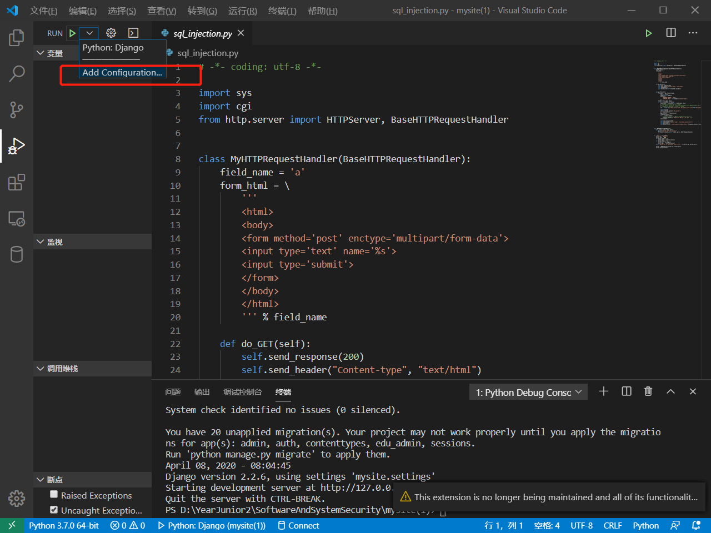                             
3. 然后在 launch.json中，会这么一个配置项                         
                              
4. 用这种方式可以调试sql_injection,然后点击sql_inejction文件，使其成为编辑器的当前文件。将自己的db.sqlite3进行覆盖，点击绿色箭头，就可以调试了。运行以后，访问http://127.0.0.1:8080/ ，是一个编辑框，输入学生ID，查询对应的成绩。                
                             
                              
5. 通过直接查询数据库，我们知道当前的用户的ID是1，所以输入1，查询。返回了用户id 1的成绩
6. 提交`1 OR 1= 1`,查出了当前系统中所有用户的成绩。相当于整个数据库我都获得了。                                               
                                 
7. 问题在代码的43行，我们直接把用户输入的数据，作为sql语句中的查询条件。
8. 最后的 sql语句为：
```sql
SELECT edu_admin_course.name, edu_admin_score.score FROM edu_admin_score INNER JOIN edu_admin_course ON edu_admin_score.course_id=edu_admin_course.id WHERE student_id = 1 OR 1=1
```
查询条件变成了`student_id = 1 OR 1=1`,`1=1`恒为真， 任何数OR真值，也是真。所以，相当于 
```sql
SELECT edu_admin_course.name, edu_admin_score.score FROM edu_admin_score INNER JOIN edu_admin_course ON edu_admin_score.course_id=edu_admin_course.id WHERE true;
```
或者没有WHERE,变成了无条件查询,于是显示出了数据中的所有记录。
9. 在软件安全中，有一个原则，所有用户的输入都是不可信的。因此，我们必须对用户输入进行过滤。进行严格的限制。
10. 有两种方法：                   
* 就是对用户输入进行过滤，比如这里。我们可以判断一下 input_data是否数字就可以。用python内置函数 isdigit
* 使用参数化查询语句。不将用户的输入作为SQL指令的一部分处理，而是在完成SQL指令的编译后，才套用参数执行
11. 但是对于大型的系统，会有很多sql语句拼接和执行的地方。每一个都去过滤，编程效率很低，而且不一定能保证你写的过滤就是对的。实际系统的业务远比我们这里输入ID要复杂。这里就在说回到Django，这就是框架ORM的意义了。ORM完全避免了程序员直接接触sql语言，所有的sql语句都在模型管理器中有框架进行拼接。程序员在编程时，只需要使用模型管理器提供的方法进行查询，创建等，就可以了。比如，我们之前写的Django代码。
```python
result = Score.objects.filter(student=request.user)
```
底层在进行sql的拼接,就避免了这种情况
12. Django的模型管理器中，主要有filter get等获取数据的方法。这些方法返回的数据类型是QuerySet数据类型。这个数据类型是一个数据库访问的接口。在调用filter时，实际上还未查询数据库，只是初步完成了数据库sql语句的拼接。
13. 实际的查询是在render中进行的。Django会根据render时需要的具体数据，来精确优化查询语句，所有这里的result，并不是真正的查询结果。而是一个查询对象。在模板 score.html 我们用到了 数据 {{ i.course.name }}.course是 socre表的一个外键，course.name实际是在course表中。所有这里其实是一个跨表查询。这种两个表的跨表查询，我们自己写的sql语言已经比较复杂了。真实系统往往会有多个表的联合跨表查询，sql语句会非常复杂。但是Django处理后，查询数据库的操作就变得非常简单，把数据中的值得访问，编程了python对象的属性访问。所以，建议大家，使用框架。但是，从学习的角度，我们需要知道Django内部是怎么做的，也就是我也需要一些底层的http server的开发原理，比如request response模式，html sql语言，数据库表结构等。底层知识要了解。这有助于我们理解Django的工作原理，学习起来就很快。对一些高级的操作也能比较深入理解。但是，具体做工程的时候，就尽量不要直接使用原始的方法了。就比如，学过windows GDI，都知道，所有的界面原始都是使用GDI绘制出来的，但是如果我们写一个软件会自己去用GDI来做原始操作吗？不会，因为有上层的软件做好了控件，我们直接调用控件，然后有了html。我们直接编写html可以快速的构建软件界面，比自己写GDI，效率高一万倍。
14. `student_id = 1; DROP TABLE xxx`这种注入方式，可以获得任意表的数据.在sqlite中，大家做实验的时候，可以用PRAGMA table_info(table_name);取得表项的名字。

## 缓冲区溢出
1. 在使用C C++编写的原生应用程序。CPU在执行是，会有一个栈的结构。这个栈的结构是程序执行过程中，与程序当前运行的所处的位置密切相关的。因此程序基本的组织单元是函数，函数的调用、返回等等是基本的操作。一个大型的程序，会形成一个函数调用关系图。
2. 栈，实际上是CPU用来记录当前执行到哪个函数的这个一个数据结构。所有每次函数调用会入栈一些东西，函数调用返回会出栈一些东西。由于栈和函数的这种一一对应，所以在设计的时候，直接把与函数密切相关的局部变量和参数也顺便保存在了栈中。如果局部变量的写入超过了预先分配的长度，就会覆盖其他数据。栈中的数据有与执行流程相关的，例如函数执行返回地址等。如果覆盖，就会造成执行流程的异常。
### 内存管理
>解答为什么一段内存不可读了，为什么有不可访问的内存地址。为什么有的时候会有执行异常等等这些问题.
几乎所有的二进制安全漏洞，必然和内存有关系。
#### 实例
```c
int main() 
{
 char* a = malloc(100);
 a[101] = 'a';
}
```
1. 这段代码，在执行的时候。不会有异常情况。程序能够正常退出。原因在于，操作系统对内存的管理，也是有开销的。系统本身需要在一块单独的系统内存中记录那些内存是可用的，那些内存是不可用的。如果记录内存是否可用这个信息太细，那么记录所有的内存开销就很高。比如，如果我们记录详细到每一个bit是否可用。如果系统的内存有1GB，记录内存是否可用的内存也需要1GB。这个开销有点太大了。所以，实际上，没有记录到这么细。在Windows系统中，通常是以4MB为单位进行管理的。也就是要么这4MB.都可用，要么都不可用。这样，所需要的管理数据就小得多。
2. [Microsoft VirtualAlloc function](https://docs.microsoft.com/en-us/windows/win32/api/memoryapi/nf-memoryapi-virtualalloc)              
所以呢，malloc还不是最底层的内存管理方式。malloc我们称为堆内存管理.malloc可以分配任意大小的数据，但是，malloc并不管理一块数据是否有效的问题。而是由更底层的虚拟内存管理来进行的.一个4KB的内存管理单元，我们称为一个内存分页。当malloc在内存分配时，如果已经可用的分页中，还有剩余的空间足够用，那么malloc就在这个可用的分页中拿出需要的内存空间，返回地址。如果已经可用的分页不够用，再去分配新的分页。然后返回可用的地址。所以，malloc分配可以比较灵活，但是系统内部，不会把内存搞得特别细碎。都是分块的。
3. 在任务管理器中，大家切换到详细信息页面,每个进程的内存占用全部都是4KB的倍数,这两个小实验，证明了，系统确实以4KB作为单元在管理内存，要么4KB全部有效，要么全部无效。                                  
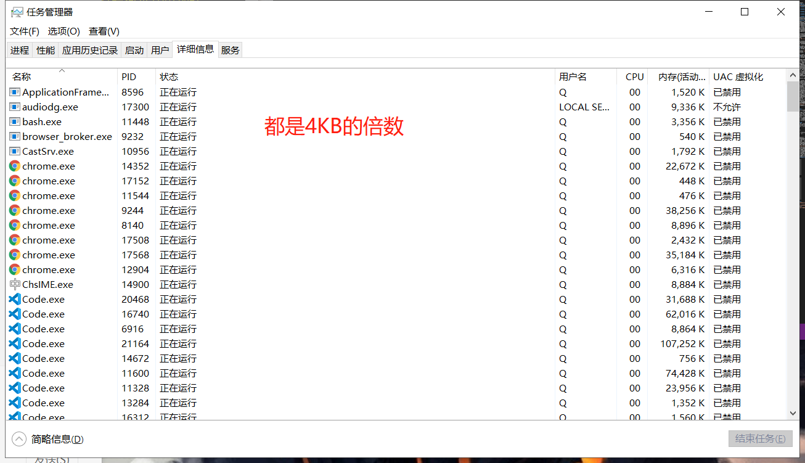                             
4. 虽然我们只分配了100个字节。但是这100个字节所在的整个4KB的内存全部是可用的。然后，我们每个4KB的内存分页，其实有三个属性，可读可写可执行.所以，我们甚至可以分配一块readonly的内存。
5. [Memory Protection Constants](https://docs.microsoft.com/zh-cn/windows/win32/memory/memory-protection-constants)                       
用VirtualProtect 函数改变一块内存的访 问属性。
6. 虚拟内管管理，系统也提供了一些的函数来让应用程序可以自己管理。分配内存是用 VirtualAlloc，释放使用VirtualFree，修改属性使用 VirtualProtec大家记住这三个函数。只要是VirtualAlloc分配的内存，就可以使用。VirtualAlloc甚至可以指定希望将内存分配在哪个地址上。malloc函数底层也会调用VirtualAlloc函数。当没有足够的整页的的内存可用时，malloc会调用VirtualAlloc.所以，实际的内存分配，没有那么频繁。

## 作业
1. 阅读[VirtualAlloc](https://docs.microsoft.com/en-us/windows/win32/api/memoryapi/nf-memoryapi-virtualalloc)、[VirtualFree](https://docs.microsoft.com/en-us/windows/win32/api/memoryapi/nf-memoryapi-virtualfree)、[VirtualProtect](https://docs.microsoft.com/en-us/windows/win32/api/memoryapi/nf-memoryapi-virtualprotect)等函数的官方文档。
2. 编程使用malloc分配一段内存，测试是否这段内存所在的整个4KB都可以写入读取。
3. 使用VirtualAlloc分配一段，可读可写的内存，写入内存，然后将这段内存改为只读，再读数据和写数据，看是否会有异常情况。然后VirtualFree这段内存，再测试对这段内存的读写释放正常。

# 第六节课（2020.4.15）
## 虚拟内存管理
1. 因为在溢出型漏洞攻击中，内存地址的有效性在漏洞利用程序的编写中是首要考虑的问题。漏洞攻击的目的，要驻留在系统内，而不是引起系统的崩溃。所以我们要了解这么底层的操作系统级别的内存管理呢。
2. 如果对内存访问不对，读写到了不可用的内存地址上。那么引起的效果是崩溃程序退出，那么攻击程序也就退出结束运行了。所以，攻击程序必须要考虑内存地址的有效性的。
3. 内存地址的有效性和访问属性，都是以4KB为单位的。这样是为了方便操作系统进行管理。我们平常所用的动态地址分配，malloc和free等，在操作系统层面，叫堆内存管理 Heap。是在虚拟内存之上的。
4. 首先是虚拟内存分页的分配释放管理。然后在分页之上进行堆块管理。其实堆快管理只是给应用程序提供的一个接口，不影响内存是否有效。还是虚拟内存在管理。堆长度可变，指定任意长度都可以，堆块是使用双链表进行管理的。而虚拟内存分页，是使用一个定长的表就可以管理了。
5. 与虚拟内存对应的是物理内存。物理内存有一个金手指，就是很多导线，插入插槽的那一段。这些线，有的是用来传输地址的，有的是用来传输数据的。当计算机在地址线上设置对应的地址是，内存就在数据线上用高低电平来给出数据。这就和cpu操作数据的读写类似。
6. 物理内存通常只有一个。所以他应该只有一套地址体系。但是我们的操作系统中，同时在运行很多程序。这些程序都需要访问地址。那如果只有一套地址体系，是不是意味着，只要去遍历一遍这个地址体系中的所有地址，是不是就可以把所有程序的所有的内存数据获取到了。如果一个应用程序的开发人员稍有不慎，那是不是会引起整个系统的崩溃。应用程序的开发人员，千千万万，水平参差不齐。系统必须设计一种机制。让一个应用程序的错误，只影响这个应用程序。也必须设计一种机制，让一个应用程序不能随意访问其他应用程序的内存。还有另外一个更严重的问题。大家共享一个地址空间，如何能做到你的数据不覆盖我的数据呢？
7. 在做exe编译的时候，有一个基地址的概念。所谓基地址，就是这个exe文件在运行的时候，它的exe文件会被放到内存的那个地址上。基地址要固定，因为只有基地址确定了以后，程序内部的很多其他的数据或者程序跳转的地址才能确定。这个地址的确定，是在程序运行之前，在编译链接的时候就确定了。
8. 何保证每个应用程序都能使用到自己想要的地址？而且，同一个exe不是可以运行很多次吗？每个的基地址不都一样吗？那么相互之间不会冲突吗。这些问题的解决就是因为虚拟地址。也就是，我们的应用程序，我们所有编写的exe文件，所有使用的地址，都不是物理地址。而是一套虚拟地址系统。这个机制在Linux中同样有效。通过分页映射虚拟。在OS的内核中，有一个非常重要的数据结构，成为分页表。这个分页表其实就是记录了每个分页地址是否可用的，它其实还记录了一个非常重要的内容，就是这一块分页，对应的是哪一个物理内存。他们以4KB单位对应。
9. 在真正的数据访问的过程中，每次访问，系统都会去查分页表，把访问的虚拟地址，在分页表中表项的记录中找到这一块虚拟地址分页对应的物理地址分页。分页内部的偏移不会变。而且，每一个进程都有一个分页表。所以其实可以把不同的进程的相同分页，对应到不同的物理地址上。所以进程A在访问地址0x400000的时候和进程B在访问同样的地址0x400000的时候。对应的是不同的物理地址。
10. 在32位系统中。地址空间从0x0-0xFFFFFFFF。一共4GB。也是一个进程最多可以有4GB的内存可用。但是我们的物理内存并没有那么多。往往一个进程也使用不了4GB这么大的数据。所以，系统是，只有进程需要使用了，才把内存分页的地址对应到物理地址上。如果没有使用，不会白白占用物理地址。这也解释了，为什么地址空间有了，0x0-0xFFFFFFFF,为什么会有的地址有效，有地地址无效，为什么有效和无效都是以4KB为单位的，要么同时有效，有么同时无效。就是因为有没有吧这一块地址对应到一个真实存在的物理地址上的。在编写操作系统内核的时候。有直接访问物理地址的情况，而物理地址不存在有效和无效的问题了。一定都是有效的，它直接对应物理内存。
11. VirtualAlloc函数                           
分配，就是以分页的大小为单位的。返回地址，是分页的基地址，是分页大小的整数倍。分页大小呢，有两种，4KB和4MB，但是一般都是4KB，是默认设置。
12. 有的时候，各个进程所使用的总内存会超过物理内存的总大小。这种情况下，部分分页会被缓存到硬盘上。但是缓存到硬盘上的内存分页数据在使用的时候，又需要载入到物理内存。专业术语叫分页交换 swap。所以，有的时候，跑大型的程序，内存占用很多，超过了物理内存大小，这时候程序仍然能运行，但是变得很慢。就因为系统在不停的进行分页交换，而硬盘的访问比内存的速度差了1-2个数量级。
13. 进程的相同地址的分页可以映射到不同的物理地址上。同样也能映射到相同的物理内存上。比如动态链接库，每个进程都会调用基础的动态链接库，但是需要在每个进程的地址空间中放置一份吗？不用，只需要把分页表中项对应过来就好了。让虚拟内存分页对应到已经存在的物理内存分页中。这既是为什么有的时候启动的进程比较慢，再启动就比较快了。使用虚拟地址的这种分页的方式，虽然有地址翻译和映射的过程，但是，效率更高。就是因为对与用量很大的底层库等实际是共享的。这也是为什么 Linux系统中动态链接库是.so后缀名（shared object）。

## 作业。
1. 验证不同进程的相同的地址可以保存不同的数据。
* 在VS中，设置固定基地址，编写两个不同可执行文件。同时运行这两个文件。然后使用调试器附加到两个程序的进程，查看内存，看两个程序是否使用了相同的内存地址；
* 在不同的进程中，尝试使用VirtualAlloc分配一块相同地址的内存，写入不同的数据。再读出。
2. （难度较高）配置一个Windbg双机内核调试环境，查阅Windbg的文档，了解 
* Windbg如何在内核调试情况下看物理内存，也就是通过物理地址访问内存
* 如何查看进程的虚拟内存分页表，在分页表中找到物理内存和虚拟内存的对应关系。然后通过Windbg的物理内存查看方式和虚拟内存的查看方式，看同一块物理内存中的数据情况。
> 其中第二个作业难度比较大。首先需要搭建Windbg的内核调试环境.由于我们直接调试的操作系统内核，所以需要两台计算机安装两个Windows，然后连个计算机使用串口进行链接。好在我们有虚拟机。所以我们需要再虚拟机中安装一个Windows（安装镜像自己找，XP就可以），然后通过虚拟串口和host pipe链接的方式，让被调试系统和windbg链接，windbg可以调试。使用Windbg  内核调试 VirtualBox 关键字搜索，能找到很多教程。如果决定Windows虚拟机太重量级了，可以用Linux虚拟机+gdb也能进行相关的实验，以gdb 远程内核调试 为关键字搜索，也能找到很多教程。
3. 参考资料
* [windbg遍历进程页表查看内存](https://www.cnblogs.com/ck1020/p/6148399.html)
* [windbg下看系统非分页内存](https://blog.csdn.net/lixiangminghate/article/details/54667694)
* [windbg下看系统非分页内存](https://blog.csdn.net/lixiangminghate/article/details/54667694)
* [使用WinDbg查看保护模式分页机制下的物理地址](https://blog.csdn.net/weixin_42486644/article/details/80747462)
* [软件安全4.内存布局](https://www.jianshu.com/p/09fab7c07533)
* [Windows 内核调试](https://zhuanlan.zhihu.com/p/47771088)
* [!pte](https://docs.microsoft.com/en-us/windows-hardware/drivers/debugger/-pte)
* [windbg - What is the relation between the VAD (!vad) the PTEs (!pte), and loaded modules and sections (lm and !dh)?](https://reverseengineering.stackexchange.com/questions/21031/windbg-what-is-the-relation-between-the-vad-vad-the-ptes-pte-and-loade)
* [When Kernel Debugging - Find The Page Protection of a User Mode Address](https://stackoverflow.com/questions/16749764/when-kernel-debugging-find-the-page-protection-of-a-user-mode-address)

# 第七节课（2020.04.22）

## shellcode
[exploit-db](https://www.exploit-db.com/shellcodes)
1. 栈溢出漏洞，当向栈中的局部变量拷贝了超长的数据，覆盖了在局部变量的内存空间之后的函数返回地址。那么当函数返回的时候就会跳转到覆盖后新的地址。那么跳转到新的地址后，这一段新的地址的数据，如果是可执行的一段代码。那么这段代码就会被执行。这段代码当然是需要攻击者来编写的，攻击者通过这段代码来实现攻击之后的控制等等功能。
2. 早期，黑客在攻击了一个系统以后，最常使用的控制方式是创建一个远程的shell，这要黑客就可以远程通过命令的方式控制目标计算机了。就像我们现在的ssh远程控制计算机一样。不过ssh是管理员主动开启的，黑客攻击后的shellcode是通过漏洞非法入侵后开启的。
3. 由于早期的黑客攻击后通常是开启一个shell，所以这段在缓存区溢出以后跳转执行的一段代码，就被称为shellcode。现在，shellcode的功能已经很多了。但是总体的目的还是对远程的目标计算机进行控制。
4. 此处[exploit-db](https://www.exploit-db.com/shellcodes)有很多shellcode，各个平台的，能实现很多不同的功能。

## 代码讲解
[Null-Free WinExec Calc.exe Shellcode](https://www.exploit-db.com/shellcodes/48116)
1. 这个shellcode的功能是运行一个计算器程序。这个是白帽子黑客们在编写PoC时最常使用的一种方法。能证明系统被控制，因为如果能悄无声息的运行计算机程序，理论上来说就能运行任何程序，改一个参数的事。
2. 下面是一段C语言的代码。其中汇编部分是源代码。C语言中的 code 变量，是前面的汇编代码在编译以后的二进制程序。这一段就是可运行的shellcode了。然后下面的main函数，是吧这个code运行起来。
3. 这一段代码用到了一个较为高级的C语言语法，函数指针。              
                              
* 定义了一个函数指针变量，func
* 这个函数指针的变量类型是 int(*)().表示返回值是int，参数列表为空的一个函数。
* 在main函数的第二行，把全局变量 code 赋值给 func。并强制类型转换为 int(*)() 类型的函数指针。这样 func就有值了。
* 就可以被调用了，由于func所指向的地址，就是code的地址，所有调用func的时候，运行的就是 code里面的那一堆二进制代码。
4. 现在VS中建一个空工程，把###########后整个C语言部分复制到VS中。         
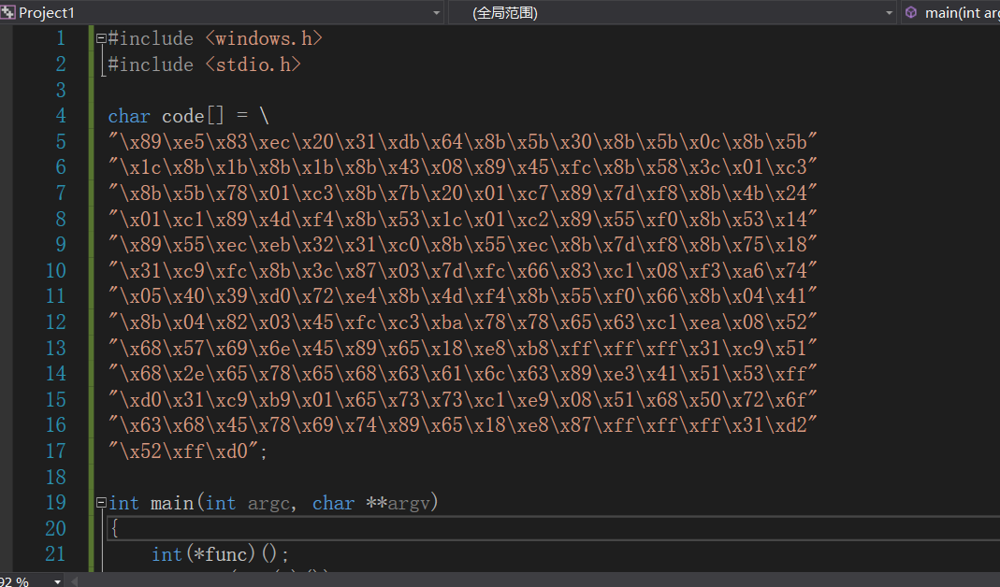                             
* 出现`错误 C2440 “类型转换”: 无法从“char [196]”转换为“int (__cdecl *)(void)” `,把.cpp重命名为 .c，再次执行
5. 调试运行
* 会出现一个错误`0x001D9000 处(位于 Project1.exe 中)引发的异常: 0xC0000005: 执行位置 0x001D9000 时发生访问冲突`                        
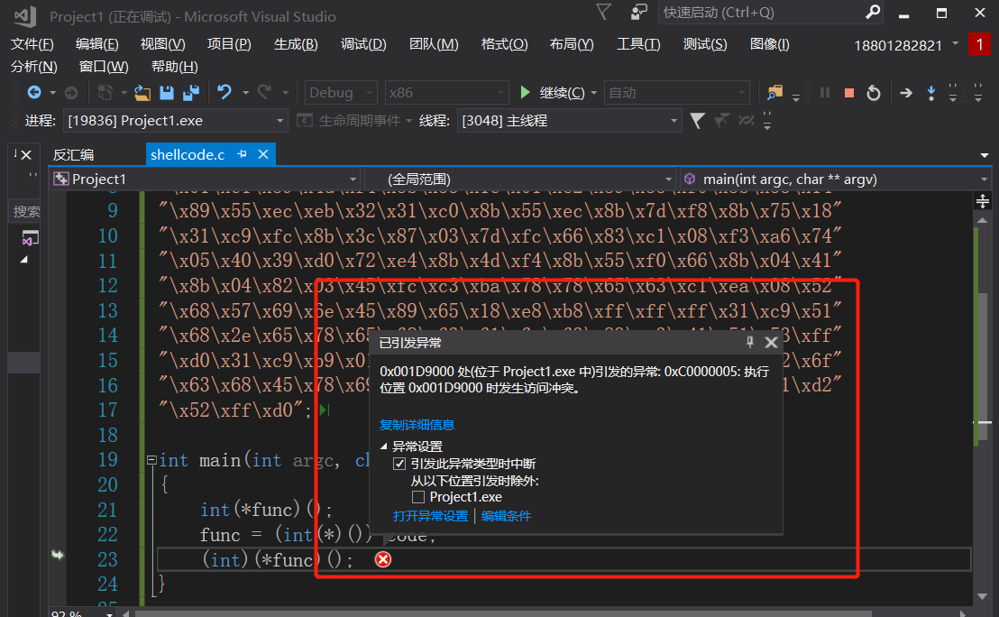                              
* 0xC0000005 是Windows系统内部错误代码，表示内存访问异常。
* 这个错误，表示你当前访问了一个未分配的内存地址。或者，所访问的内存地址的保护属性冲突。比如如果内存的保护属性是 readonly，但是你写入了，那么也会引起这个访问异常错误。
6. 下一个断点，单步执行。是在运行`(int)(*func)()`时出错的。           
                             
* 这一行是调用 func执行，而现在func是指向code的，也就是func的值是code的内存地址。
* 而code这段内存是存在的，它是一段已经分配的内存。因为它是全局变量，在程序运行起来后，就存在内存中，是进程的初始化过程就完成了内存分配，并由进程初始化程序从可执行文件中直接载入内存的。全局变量，肯定是有效地址，是可以访问的。
* 那就应该是第二种情况，内存分页的保护属性问题。
* 其实和Linux里的文件类似，操作系统中的内存分页，也分为读写执行三种保护属性。由于code是全局变量，是数据，通常情况下，会给数据设置可读和可写的内存保护属性，但是一般不会给执行属性。但是我们要去执行它，所以可能引发了异常。
7. `func = (int(*)()) code;`处下断点，调试窗口->右键转到反汇编。
8. F1直到停到`call func`处              
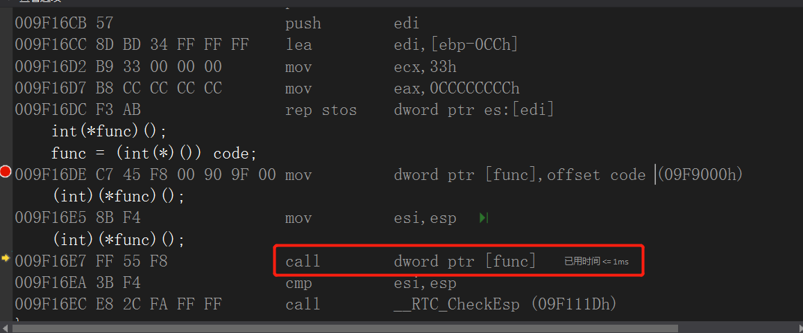                              
9. 再按F11，`mov         esi,esp`处出现异常                  
                             
这里 00FD7000 就是code的第一个字节的位置
10. 修改错误，就是修改内存保护属性。用`VirtualProtect`,改一下代码         
```c
int main(int argc, char** argv)
{
	int(*func)();
	DWORD dwOldProtect;
	func = (int(*)()) code;
	VirtualProtect(func, sizeof(code), PAGE_EXECUTE_READWRITE, &dwOldProtect);
	(int)(*func)();
}
```
出现了计算机                       
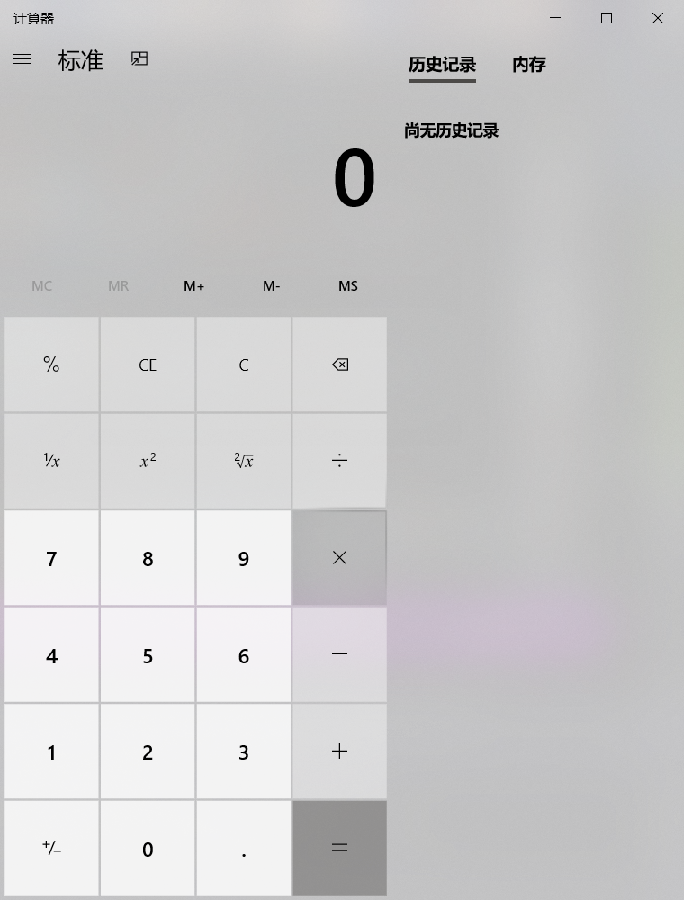                              
* VirtualProtect 函数会把第一个参数，这里是 func，所指向的内存地址的 第二个参数，这里是 sizeof(code)，这段内存区域所在分页的内存属性修改为第三个参数的属性。
* PAGE_EXECUTE_READWRITE 表示这段内存，是可读可写可执行。
* 通过第四个参数 dwOldProtect 反正在修改之前的内存保护属性。
11. `(int)(*func)();`处下断点，运行到断点处，转到反汇编，F11           
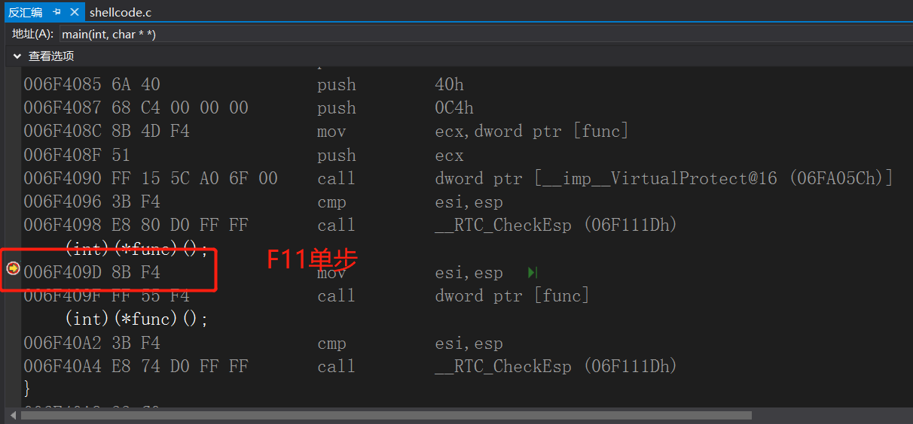                             
* 和源代码中的汇编部分，是不是一样的                         
                              
* 字节码部分 89 e5 ... 是和 code一样的
                             
* code反汇编之后，就是汇编的源码。其实，我们这段code，就是通过前面的汇编代码，编译以后直接从汇编编译以后，从可执行文件中 dump出来的。
12. 把下图代码保存为`win32-WinExec_Calc-Exit.asm`传到linux系统                   
                             
```bash
# linux
nasm -f win32 win32-WinExec_Calc-Exit.asm -o win32-WinExec_Calc-Exit.o
for i in $(objdump -D win32-WinExec_Calc-Exit.o | grep "^ " | cut -f2); do echo -n '\x'$i; done; echo
```
                              
13. 如果我们用C语言编写一个运行计算器的程序，其实很简单。我们只需要调用一下WinExec函数，或者CreateProcess函数。如果用汇编来写，也就是几条指令的事。几个参数 push 入栈以后，call函数地址就可以了。就能调用函数地址。
14. 那为什么我们这段代码写的这么复杂呢？一百行左右了吧.还有循环。
* 如果我们是在C语言中编写调用WinExec函数，那个call之后的WinExec函数的地址，是编译器帮我们在可执行程序的导入表中导入了。在进程初始化的过程中，系统会帮我们计算好WinExec函数的地址，然后把函数地址放在导入表中指定的位置。
* 在shellcode中，有这个过程吗？要意识到，我们最终是要把这代code嵌入到溢出攻击的数据中。被攻击的目标对象会有动态链接的过程吗？没有，也就是code这段代码，如果要call WinExec，那么WinExec函数在哪？没人告诉code。也就是说，shellcode，其实干了一个进程初始化的过程中，操作系统在干的事情——API函数的动态链接。也就是找到需要调用的API函数的地址。
* 那这个问题简单啊，我们不是有GetProcAddress函数吗，这个函数就可以获得API函数的地址啊。问题又来了，GetProcAddress函数，也是一个API.GetProcAddress函数的地址也不知道呢，如果能调用GetProcAddress函数，那WinExec也能调了。
* 所以任何 API地址都没有。shellcode进入到了一个完全陌生的环境。所以早期的黑客们，想了很多办法，能不能比较原始的办法，能够获得API地址。其实操作系统，也有一个加载的过程。黑客们逆向分析了Windows系统的内部代码，分析了Windows系统内部管理进程初始化相关的数据结构。发现有一个链表，管理了所有的已经加载的dll文件。
* 这个链表，就是我们这个代码里InitOrderModuleList.这个InitOrderModuleList 在一个称为 LDR 的数据结构里。这个LDR的数据结构，又在 PEB(进程环境块)这个数据结构里。而PEB数据结构，在每个进程中，是一个固定的位置，是一个绝对的常量地址。这个地址就是fs:ebx+0x30。所以地址就可以不依赖于任何API或者其他依赖，直接用汇编代码就能访问到。
* 从这里我们能一层层找到dll的基地址。然后再从dll的基地址，通过PE文件的数据结构，文件头，找到dll的导出表。然后再在导出表中的数据结构中，通过函数名称的比较，得到已经在内存中的函数的地址。所以代码中的循环，findFunctionAddr 的递归函数，和searchLoop就是在遍历dll的导出表。
* 代码中大量使用到了硬编码的偏移地址，比如就是因为上面这些说到的系统的数据结构，都是固定的结构，在每个系统中都是一样的，所以可以固定。
* 通过系统中若干数据结构这种原始的访问方式，可以找到API函数。
15. shellcode中还用到了字符串。至少函数地址的名称是需要的。还有调用WinExec的参数 calc.exe
* 如果我们在C语言里编程，编译器会把可执行程序的代码和字符串，放在不同的地址。代码 机器指令在 text段中， 字符串在data段中。地址相差很远。而我们objdump，只取了代码段，没有取数据段，那要shellcode就太大了，而且中间可能会有很多的填充字符。而且数据地址很有可能是绝对地址。
* code一dump出来，放在了其他环境中执行，那么地址就变了。所以字符串，code也是找不到的。编一个程序，用到字符串，可以看看字符串的地址和代码的地址，差很远。那唯一的办法，用一种什么方式，把字符串硬编码在shellcode中。让字符串，变为代码的一部分，内嵌在机器指令中。
* 636c6163，6578652e是 calc.exe的big ending 反写。压入栈以后，就形成了字符串。这样就把字符串嵌入机器指令了，作为机器指令的操作数。            
                 

## 作业
1. 详细阅读 www.exploit-db.com 中的shellcode。建议找不同功能的，不同平台的 3-4个shellcode解读。
2. 修改示例代码的shellcode，将其功能改为下载执行。也就是从网络中下载一个程序，然后运行下载的这个程序。提示：Windows系统中最简单的下载一个文件的API是 UrlDownlaodToFileA
3. 其中第二个作业，原参考代码只调用了一个API函数，作业要求调用更多的API函数了，其中涉及到的参数也更复杂，但是原理是相通的。URLDownloadToFileA函数在 Urlmon.dll 这个dll中，这个dll不是默认加载的，所以可能还需要调用LoadLibrary函数
## 参考资料
* [microsoft !peb](https://docs.microsoft.com/en-us/windows-hardware/drivers/debugger/-peb)
* [PEB结构学习](https://www.cnblogs.com/binlmmhc/p/6501545.html)
* [microsoft PEB structure](https://docs.microsoft.com/en-us/windows/win32/api/winternl/ns-winternl-peb)
* [Process_Environment_Block](https://en.wikipedia.org/wiki/Process_Environment_Block)

# 第八节课（2020.4.29）
## 二进制安全
1. 二进制安全是整个软件安全中核心的内容。因为二进制是软件的最基本形态。所有的基础软件都是以二进制软件的形式存在的。包括操作系统、浏览器、数据库、中间件、各种脚本软件的解释执行器。还有很多大型游戏等等。都是二进制软件。
2. 二进制软件的基本特征，是它是CPU可以直接运行的机器指令。所以不同平台的二进制软件是不同的，二进制程序，无法跨平台。也就是Intel架构的cpu的二进制无法在ARM架构上运行，反之也是。CPU能够运行的机器指令都是二进制的，包括了很多非ASCII的不可打印字符。同时二进制程序还需要操作系统的支持，所以二进制形式的软件也是无法做到跨操作系统运行的。
3. 但是，软件的开发，人对二进制或者十六进制的数据阅读比较困难。如果直接使用二进制或者十六进制进行编程，那么效率会非常低下。所以我们编程的时候都不是直接处理二进制的。而是我们发明了一种直接使用文本来编程的方式，但是我们编写出来的文本代码，CPU并不能理解执行。所以，还需要一个转换和处理的过程，这个过程就是编译和链接。程序员编写出来的文本形式的代码，成为源代码，编译后生成的机器可运行的代码，称为目标代码。
4. 我们首先发明的源代码是汇编形式的，是使用的和机器指令一一对应的汇编语言。是一种直接最简单的操作指令级别的翻译过程。汇编的编程还不是很方便，后来发明了C语言等高级语言，高级语言不止C语言一种，但是c比较成功。
5. 研究二进制安全，首先需要了解的就是二进制软件和源代码，已经后再之后出现的脚本语言的关系。
6. 那么要知道一个东西安全还是不安全，或者具体有什么安全问题，看表面是不够的。在软件安全的研究中，往往需要深入内部细节，需要了解的软件的具体原理。也就是需要到代码级别去。
7. 在前人的研究中，已经发现了很多种软件安全典型的问题。比如栈溢出、堆溢出、格式化字符串漏洞、空指针、整形溢出等等。软件安全研究的核心问题，就是两个。一个是安全问题（也叫脆弱性，通常我们叫漏洞）的存在性问题，一个是这个安全问题的可利用性问题，也就是安全漏洞具体有什么危害，如果达到这个危害，如何防止。
8. 对应的就是，就是漏洞挖掘和漏洞利用，两方面的技术。比如漏洞挖掘，由于软件安全的漏洞都是具体的，都是由软件内部的代码的编程不慎所引起的。所以漏洞挖掘，其方法就是分析代码。
9. 二进制的机器指令序列构成的软件，人解读起来很麻烦，我们如果直接读二进制，效率及其低下。所以我们通过是在了解了二进制机器指令的基本原理后。通过一些辅助的工具来解读。但是呢，通过安全人员分析软件的时候，只有二进制这个目标。比如，我们是一家安全公司，我们捕获了一个攻击程序。我们能拿到源代码吗？当然不能，源代码在发起攻击的人，也就是黑客的手上。所以很多时候，我们只能分析二进制。所以很多时候，我们只能分析二进制。
10. 在只有二进制的情况下，我们有什么方法呢？这也是我们在学习软件安全之前，要学习逆向工程的原因。我们通过逆向工程的一些技术，把二进制软件解构、翻译，然后就能理解其实现的原理。
11. 第一个方法就是反汇编、以及在汇编代码上的一些解构、比如获得函数列表、获得每个函数的调用关系、获得函数内部的控制流程图。这些是可以从二进制中获得信息，那是是不能逆向出来的呢？变量名、函数名、注释、一些数据类型。这些是源代码层面方便程序员的，对于二进制软件来讲，名称信息没有用处，机器指令内部全部是使用“数据和代码的存储地址”。反汇编，有一些工具可以使用。基本的如dumpbin、objdump高级的有IDA-pro等。另外，所有的调试器也都有反汇编功能。第二重要的工具就是调试器。调试器其实比反汇编器要高级很多。因为反汇编器只能在程序没有运行起来的时候去观察它，而调试器可以在程序运行起来以后，随时中断程序的运行并观察。当时是运行时的信息要丰富的多。比如运行时候可以看到用户输入的数据、外部读入的数据、这些数据的具体处理过程，某个变量在运行时的赋值情况等。这些信息都是静态的反汇编所没有的。但是，信息丰富，也有问题，就是需要分析和处理的数据量是非常大的。调试器还要一个反汇编器说没有的功能，就是它能捕获程序执行的异常信息，在软件分析的过程中，是非常重要的，因为二进制软件的安全问题，通常会引起程序运行时的内部数据结构被破坏，比如各种溢出，其实是覆盖了正常的数据。那内部数据结构被破坏以后，程序在后续执行时，可能访问这些不正常的数据，进而引起运行时错误。大多数运行时错误，最后都变成内存访问的异常。这就需要我们之前给大家讲的虚拟内存管理方面的知识。
12. 只有这些工具，距离发现具体问题，还有距离。我们得了解具体漏洞产生的原因，比如溢出，为什么溢出是严重的安全问题。前面也讲过。那么我们就来找漏洞吧。其中最直接的思路，是一行行看代码。这个方案有可行性。但是也会遇到一个巨大的麻烦。那就是软件是一个非常复杂和庞大的事物，比如Windows，有上万名开发人员，持续开发了20年。发布了无数个版本。如果我们一行行看他的代码（还不是源代码、是二进制反汇编代码）那么是不是需要和开发人员同等数量的人员和时间呢？这往往是达不到的。所以漏洞的挖掘，极少情况下会直接人工分析源代码。安全研究人员们，更希望借助自动化的工具。到现在为止，我们已经发明出了两大类自动化工具了。一种就是模糊测试工具，一种是程序分析工具。这两种工具，代表了两种思路，一种是认为软件很复杂，我们干脆不要去看内部了，把软件当做一个黑盒子。只看它的外部表现，给它各种各样的输入，看它在处理过程中会不会出现异常，如果有异常就说明软件在设计的过程中，没有考虑到用户会输入这种样子的数据，和软件的预期不符合。那么预期不符，有接纳了这样的数据处理了，那是不是漏洞啊。就是的。这要通常会引起程序的崩溃，刚才我们又说了，调试器就用捕获程序异常功能。所以我们用调试器来捕获这要的异常，是不是就能实现自动化了。
13. 通过研究漏洞的原理，我们知道，漏洞是畸形的数据数据引起的，比如输入了一个超长的字符串，比程序员内部预留的长了，就溢出了。所以这种输入畸形数据去尝试触发崩溃的方法，理论上也是可行的。那怎么构造畸形数据呢？最直接的方法就是随机。随机并不是每次都能构造出正好合适的畸形数据，但是量大了以后很有可能有那么一两次。随意我们就随机的构造大量的数据。好在，软件虽然复杂，但是运行速度很快啊。这正是计算机的优势嘛。所以我们可以不停的去运行目标软件，让他来处理这些随机构造的可能是畸形的数据，然后运行的时候启动调试器来捕获可能得异常，虽然不是每次都能触发异常。我们可以一直不停的让程序自动运行。这种自动化的方法就是模糊测试。也叫Fuzzing。原理简单，但是可行。
14. 第二种方法就是程序分析，和第一种截然不同。这种方法把是要深入软件的内部原理的，要去分析它的每一行代码。这里面代表的技术比如危险函数定位和符号执行等。危险函数定位的思路是，既然strcpy等能引起缓冲区溢出，那么我就把全部的strcpy找出来看一看。这个方法呢，简单了点。随着研究的深入，人们发现，不是所有的漏洞都是危险函数引起的，内存操作的方法各种各样，千奇百怪。而且不是所有的危险函数都会引起安全问题。比如调用之前进行了长度判断，就不会。所以这种方法效果很差。分析方法，逐步复杂，现在的代表方法是符号执行。我们有专门的课讲符号执行。漏洞挖掘，也就是安全问题发现先梳理到这儿。
15. 下一个问题是安全缺陷的危害，也就是可利用性问题。漏洞挖掘技术现在是攻防双方都在使用。软件的开发人员也在采用黑客发明的漏洞挖掘技术来挖自己的漏洞，以争取在软件发布前把安全问题尽量发现和修补了。漏洞利用技术。上节课我们重点讲了shellcode。编写exp（漏洞利用程序）也是软件安全研究人员的基本功。exp一般分为攻击数据部分，比如一个超级长的字符串，用来溢出缓冲区；和攻击成功后的控制部分，就是shellcode。shellcode很多时候可以通用，但是攻击数据部分，每个漏洞都不一样。这部分的学习，比较有效的办法就是去阅读和使用别人写好的exp。kali Metasploit exploit-db上有很多这样的程序，有一些安全研究人员的个人博客上也有很多。这个是一种重要的学习方法，我们称为漏洞复现。
16. 那么哪里去找别人已经挖掘发现的漏洞呢？一开始，一些软件厂家，比如微软会定期升级自己的系统，打补丁。在打补丁升级系统的时候，就会同时给出安全公告，说他修补了那些问题。但是并不是每个软件厂家都有能力或者意愿去维护一个安全漏洞。有一些第三方的组织就来收集各种漏洞，并形成了一个统一的数据库，比如CVE。CVE给每个漏洞都编写，说明漏洞影响的软件及其版本，危害程度等等详细信息。少量的漏洞还会给出PoC，也就是概念验证程序。早期的漏洞很多都有PoC，因为那个时候，很多软件厂家不重视漏洞修补工作。漏洞的发现人员，或者安全厂商放出PoC也能逼迫软件厂商去修补。现在，软件漏洞的披露已经很规范了。国家也重视，所有美国和我们有国家安全漏洞数据库，美国有NVD，我们国家的CNVD和CNNVD。这些都是大家去找已经公开的漏洞的地方。
17. 如果我们拿到了一个漏洞的详细公告，也拿到了PoC，我们如何去复现这个漏洞呢？当然是得安装一个有漏洞存在的软件版本。这个过程中，一个重要的工具就是虚拟机。我们通常在虚拟机里安装配置。因为漏洞需要的环境可能和我们的工作主机的环境冲突很大。而且漏洞环境复现过程中，可能会破坏系统。如果我们要复现很多漏洞，不在虚拟机中进行，会把自己的工作环境弄得很乱。所以VirtualBox等虚拟机软件也是我们经常要用的工具。和虚拟机类型的，还要模拟器。模拟器和虚拟机相似又不同。他们都是在内部构造了一个“虚拟的机器”这个虚拟的机器可以和真实的机器一样安装和运行操作系统以及各种软件。但是虚拟机，还是借助的物理CPU的虚拟化功能，而模拟器是使用软件来“实现”了一个CPU及其附属的设备。所以虚拟机的host系统和guest系统，只能是同一架构的，比如物理主机是intel架构，那么host和guest都这能是Intel 0x86架构的系统，比如Windows和Linux x86。但是模拟器就可以跨架构。host是Windows x86，guest是arm架构的安卓系统。
18. 模拟器的典型代表是[QEMU](https://www.qemu.org/),如果我们要研究安卓系统、路由器等MIPS架构的系统，就需要模拟器。模拟器通常也有调试、单步运行等功能。除了用于漏洞复现，也可用于漏洞挖掘。比如我们要挖掘一个路由器的漏洞，我们不能直接对着物理路由器Fuzzing，因为就是触发了异常，也无法捕获。所以通常是把固件提取出来，在模拟器中运行。
19. 漏洞复现学习完了。我们还在研究一下软件攻防。黑客如果通过攻击，进入到了一个目标系统。那么他除了要考虑窃取信息、加密硬盘（勒索软件）、破坏数据等攻击之外，还需要考虑一个问题。第一是不留痕迹，第二是不能被杀毒软件和主机中的一些防御系统识别。早期，安全研究人员也在想办法对抗漏洞攻击和计算机病毒（计算机病毒其实就是一个可以自我复制的漏洞利用程序）。他们想到的办法就是杀毒软件，杀毒软件的基本原理是把已经发现的病毒等各种恶意程序的特征值记录在数据库中。每当系统中有新的文件时就计算一下这个文件的特征值，然后和数据库中的特征值进行比较。如果匹配上了，说明这是一个恶意程序。
20. 特征值通常是hash值。因为恶意软件很多，我们不可能把整个恶意软件都作为特性，占用空间也不方便分发特征值。（分发特征值就是病毒毒升级）。但是学过密码学的同学都知道，如果源数据稍微变化一下，hash值就变化了。比如病毒修改自己的一个无意义的常量数据，功能不变，杀毒软件就无法查杀了。所以后来有发明了动态的基于行为的检测。总之呢，恶意软件需要隐蔽自己。比如文件、进程、通讯的端口都需要隐藏起来。这就是rootkit技术。
21. rootkit技术，很多是基于我们上个学期讲的API hook。通过挂钩API，篡改了操作系统的行为，当防御软件在列举目录中文件时，根本就获取不到攻击程序的文件。防御软件和攻击软件就是一个技术博弈，此消彼长的过程。产生了非常多很有意思的技术。比如攻击软件为了放在被发现，根本就不产生文件。我们都知道可执行程序首先是一个文件，在系统上创建进程运行。后来出现了根本不产生文件，也不修改其他文件，寄生在其他可执行程序进程中、直接从网络加载到内存就能运行的恶意程序。
22. 软件攻防的技术，还衍生出另外一大类恶意软件。就是外挂。外挂程序也是通过修改正常程序的软件行为，比如直接篡改内存中的数据，或者挂钩其函数，达到修改软件行为的目的。开发和防御外挂软件的技术与软件攻防技术相似。都是需要使用逆向工程工具、调试器等等、都需要大量的数据分析工作。

# 第九节课（2020.5.6）
## Fuzzing
1. Fuzzing目前也是漏洞挖掘的主要方法之一，是各种漏洞挖掘技术中人力消耗比较低，技术门槛比较低，同时效果却比较好的一种方法。其他的方法，比如程序分析、符号执行等也人在用。但是难度相对较大一些。
2. 首先，第一个我们需要确定一个目标。你对什么软件进行漏洞挖掘，软件是做什么的。数据来源是文件还是网络，或者既有文件又有网络。因为我们知道Fuzzing的主要原理就是随机性的大量给被测试软件输入数据。当然首先就需要知道软件是处理什么样的数据的，应该如何给软件输入数据。
3. 一般来讲，现在主要就是文件和网络两种。如果是文件型的，最典型的比如Word。那么我们就需要构造大量的文件。如果是网络的，比如一个Web服务器，那么我们就需要构造大量的网络数据包发送给被测试软件。我们一般称为文件型Fuzzing和网络型Fuzzing
4. 选定了被测试软件以后，下面就需要构造软件的运行环境。如果是Windows Linux的应用软件，可以直接运行。如果是手机软件，由于手机自带的调试功能比较弱，比方便控制和输入，一般可能需要一个模拟器来运行。
5. 有了运行环境以后，下一步，需要选择一个Fuzzing的框架。Fuzzing技术发展了很多年，有很多人已经开发了不少框架。框架已经解决了Fuzzing测试中的一些基本的共性的问题，我们不需要重头开始做。在框架的基础上，我们只需要进行一些配置或者少量的编程就可以开始进行测试了。
6. 然后，我们需要选择一种策略。比如是基于生成的还是基于变异的。那什么是基于生成的呢，就是我们的数据完全是重新构造的，不基于一些已有的数据或者模板。当然重新构造的过程中，也不能完全瞎构造，通常有效的测试数据并不是完全畸形的数据，而是半畸形数据。因为完全畸形的数据，可能在到达测试对象之前就已经被丢弃了。比如一个网络数据包，如果不符合数据包的基本格式。连IP地址都不对。那肯定是到不了被测试对象的。所以基于生成的，也需要在规则、协议、文件格式的基础上进行。所以基于生成的策略，一般只对协议已知、格式开放的目标。那么一些位置协议或者格式不清楚的数据，就可以采用基于变异的策略。在已有的合法数据基础上，通过一定的随机性的变化来得到测试数据。已有的合法数据比较容易得到，比如很多年前，Word没有开放doc文件的格式。如果我们要对Word进行Fuzzing，就应该采取基于变异的策略。用Word先保存生产一个合法的doc文件，再在这个合法的doc文件的基础上大量变异，也就是随机性的替换一些数据、插入删除一些片段数据来得到大量的测试数据。同样，如果是对网络程序进行Fuzzing。我们可以让网络程序先正常运行，抓取数据包。然后对抓取的数据包进行重放，重放过程中进行一定比例的变异（随机性的替换、插入、删除）。
7. 总之，模糊测试技术是一种通过注入缺陷实现的自动化软件测试技术。其基础是在执行时将包括无效的、意外的或随机的数据输入注入到程序中，监视程序是否出现崩溃等异常，以获取意外行为并识别潜在漏洞。模糊测试的重点在于输入用例的构造。测试用例的生成方式可基于生成或基于变异。基于生成的模糊测试(Smart Fuzzing)首先对目标程序进行分析，尽可能收集有关它的信息，基于这些信息生成测试数据。此技术基于前期大量分析构造有效的测试数据，自动化程度相对较低。基于变异的模糊测试(Dumb Fuzzing)根据一定的规则对现有的样本数据进行修改并生成模糊测试用例。该生成方法简单，但是并未考虑程序自身的特点，因此生成测试用例有效性较低，漏报率高。但是模糊测试在一定程度上降低了安全性测试的门槛，原理简单，一般不会误报。但是对目标对象知识的获取程度直接影响模糊测试的效果。而且，模糊测试技术无法检测所有漏洞。
8. 下面我们来针对一个具体的目标来说明。大家都用过家里上网的路由器，WiFi。这种路由器也是存在安全性漏洞的。那么如何对家用路由器采用Fuzzing技术进行漏洞挖掘呢？首先，需要了解到，这种路由器，其实是硬件和软件一体的一个小型的设备。它的架构和我们的电脑、手机其实有相同的地方。它也有CPU、内部有操作系统、在操作系统中还有少量的应用软件，来实现路由器的一些功能。不同的是，这种小型路由器一般是MIPS架构的CPU，我们的电脑一般是intel架构的CPU(x86 x64)，Intel架构的CPU既包括Intel生成的CPU也包括AMD公司生产的CPU。我们的手机都是ARM架构的CPU。这几种架构各有特点。MIPS适合小型化设备，功耗低性能弱、价格便宜，结构简单。ARM适合中型一些的设备，体积小能耗小功能适合手机，但是价格比较高。x86_64适合电脑和服务器，能耗高（发热也就高）、性能最高，价格最贵，结构最复杂。当然这几种CPU架构，他们的指令集是不一样的，所以有各自的汇编语言，也有各自的编译器工具链。我们知道，手机操作系统并不能运行在PC上。
9. 同样这种路由器的操作系统，也无法直接运行在PC上。所以前期有一些环境搭建的工作。需要把路由器的系统运行在模拟器中。QEMU就是中场景下广泛使用的模拟器。所以如果进行家用路由器的漏洞挖掘，首先第一步可能是安装 [QEMU](https://www.qemu.org/)                 
* ubuntu下，一个成功的QEMU安装实例：
```bash
apt-get install zlib1g-dev
apt-get install libglib2.0-0
apt-get install libglib2.0-dev
apt-get install libtool
apt-get install libsdll.2-dev
apt-get install libpixman-1-dev
apt-get install autoconf
apt-get install qemu
apt-get install qemu-user-static
apt-get install qemu-system
```
10. QEMU的基本原理是模拟各种CPU的执行环境，用软件来实现CPU的硬件功能并封闭出来执行的环境。使用QEMU可以跨平台运行系统和软件。在软件开发和调试中应用非常广泛。比如我们开发手机APP，安卓系统的调试模拟环境就是基于QEMU的。但是由于后面我们还有其他工具大多时运行在Linux系统中的，所以我们的Fuzzing实验可能需要再Linux系统中进行。
11. 有了第一步，执行环境有了。第二步，我们需要把我的目标程序在执行环境中运行。路由器的操作系统和整个应用软件，是植入到路由器的存储器中的。就像我们的PC中的系统和软件安装在硬盘上一样。由于路由器功能单一，系统不大，所以一般将操作系统和应用程序打包成一个镜像文件。称为固件,Firmware。如果有了固件，就可以在模拟器中运行整个路由器了。所以路由器这种东西也是分为硬件和软件的，其bug和漏洞也主要是出现在软件中，硬件中的问题，我们一般不考虑。软件都位于固件中。固件的主体是一个裁剪过的微型Linux系统。然后在这个系统至少运行一些实现路由器功能的应用程序。比如会有实现路由协议的实现包转发的程序、有实现用户配置的程序（一般是一个Web服务器）、有实现内网地址分发的DHCP的程序等。
12. 要得到固件，有两种办法。一种是直接从路由器中提取。一种是从官方网站上下载一个固件。路由器中当然是有固件的，否则它不能运行。厂家的官方网站有时候会开放固件供下载，因为有一些用户有升级固件的需求，比如上一个版本的固件中发现了bug，厂家就会在网站上发布一个新的固件，让用户在配置界面中升级。虽然对大多数用户不会去升级路由器的固件。但是负责任的厂家有更新的义务。不过既然绝大部分不更新，也不会更新，所以也有一些厂家不提供。那么如果有有固件的，我们可以直接下载，没有的，就需要提取。提取固件，也有现成的工具，比如binwalk。比如这是使用binwalk工具提取了一款tenda路由器的固件。           
                              
13. 提取以后的固件使用QEMU加载运行.使用qemu-arm-static运行提取的固件                              
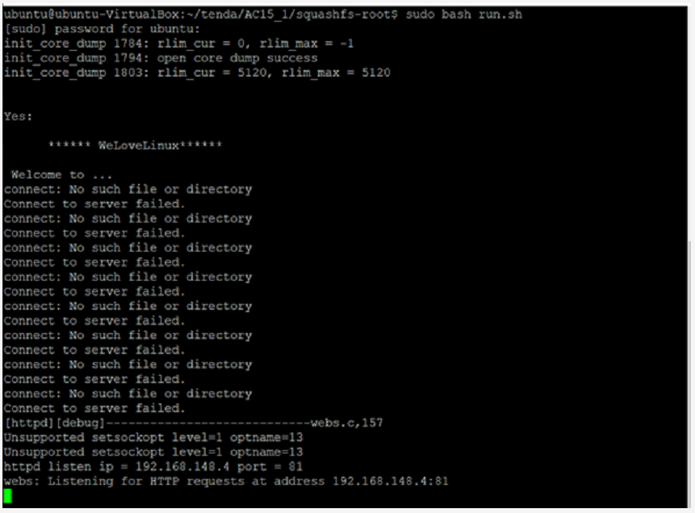                             
可以看到，路由器中用于用户配置的Web服务器已经运行起来了。这种小型设备一般使用httpd这种小型的静态的http server. 
14. 这个图比较清楚的说明了，我们搭建一个针对这种小型路由的漏洞挖掘工作环境的流程。                        
                              
15. 有一些下载的固件或者固件内部的部分软件是源代码形式的。所以可能还需要编译一下。这里的编译和我们之前用过的编译不同。称为交叉编译。我们以前在一个x86架构下的PC中，编译一个本架构下的软件，编译后在本机运行。而交叉编译是编译一个在其他系统中运行的软件，比如在x86系统中编译一个MIPS架构的软件。由于MIPS架构的主机一般性能不高，软件环境单一，所以通常不作为工作环境，也跑不起来编译器。所以我们在PC上进行编译发布在响应环境中运行。这种称为交叉编译。mips-gcc 和 mipsel-gcc 编译器就是交叉编译器。所以，在实验过程中，根据情况，可能还有其他的支撑工具需要使用。
16. 搭建好环境以后，系统和应用已经运行起来。下一步，就可以使用Fuzzing测试工具进行测试了。前面说，Fuzzing已经有一些框架可以使用了。SPIKE、AFL、Sulley、BooFuzz
17. AFL（American Fuzzy Lop）是由安全研究员Michał Zalewski开发的一款基于覆盖引导（Coverage-guided）的模糊测试工具，它通过记录输入样本的代码覆盖率，从而调整输入样本以提高覆盖率，增加发现漏洞的概率。其工作流程大致如下：
    1. 从源码编译程序时进行插桩，以记录代码覆盖率（Code Coverage）；
    2. 选择一些输入文件，作为初始测试集加入输入队列（queue）；
    3. 将队列中的文件按一定的策略进行“突变”；
    4. 如果经过变异文件更新了覆盖范围，则将其保留添加到队列中;
    5. 上述过程会一直循环进行，期间触发了crash的文件会被记录下来。                            
                             
可以看出AFL是基于变异策略的。所以Fuzzing测试，有一个目标就是通过输入畸形数据让程序崩溃crash.程序的崩溃往往就意味着有bug或者有漏洞。然后对引起崩溃的输入样本，或者崩溃或的系统日志、dump文件等进行分析。AFL用了一种称为插桩的技术来进行崩溃的检测。
18. SPIKE是由Dave Aitel编写的一款非常著名的Protocol Fuzz（针对网络协议的模糊测试）工具，完全开源免费。它提供一系列API用于用户使用C语言创建自己的网络协议模糊测试器。SPIKE定义了许多可用于C编码器的原语，这些原语允许其构造可以发送给网络服务的模糊消息以测试是否产生错误。SPIKE功能如下：
    1. 含大量可用于处理程序中产生错误的字符串。并且，SPIKE能够确定哪些值最适合发送到应用程序，从而以一种有用的方式导致应用程序异常。
    2. SPIKE引入“块”的概念，用于计算由SPKIE代码生成的数据内指定部分的大小，并且可以将这些值以各种不同的格式插入。
    3. 支持并以不同格式接收许多在网络协议中常用的不同数据类型。
SPIKE功能强大，是一款优秀的模糊测试工具，但是文档较少，只能根据各种参考资料和一些测试脚本整理常用的API使用方法。
19. Sulley是由Pedram Amini编写的一款灵活且强大的模糊测试工具。可用于模糊化文件格式、网络协议、命令行参数和其它代码。除了专注于数据生成外，Sulley还具有如下功能：
    1. 监视网络并保留记录。
    2. 检测和监控目标程序的健康状况，能够使用多种方法恢复到已知的良好状态。
    3. 检测、跟踪和分类检测到的故障。
    4. 可以并行执行测试，提高检测速度。
    5. 自动确定测试用例触发的特殊错误。
Sulley功能比SPIKE更加的完善，能够进行构造模糊测试数据、监测网络流量、进行错误检测等，但是Sulley检测只能用于x86平台。
20. Boofuzz是Sulley的继承与完善。Boofuzz框架主要包括四个部分：
    1. 数据生成，根据协议原语构造请求。
    2. 会话管理或驱动，将请求以图的形式链接起来形成会话，同时管理待测目标、代理、请求，还提供一个Web界面用于监视和控制检测、跟踪并可以分类检测到的故障。
    3. 通过代理与目标进行交互以实现日志记录、对网络流量进行监控功能等。
    4. 有独立的命令行工具，可以完成一些其他的功能。
21. 可以看出，以上几种主要的模糊测试工具中，BooFuzz是比较适合的一种。所以下一个需要进行的工作就是安装和配置BooFuzz
22. 使用Boofuzz对模拟器环境中的路由器程序进行测试主要步骤为：
    1. 根据网络请求数据包构造测试用例请求；
    2. 设置会话信息(目标IP、端口号等)，然后按照请求的先后顺序将其链接起来；
    3. 添加对目标设备的监控和重启机制等；
    4. 开始测试。
23. 比如上面那个tenda路由器，在运行起来以后，如果我们对其http服务进行Fuzzing，我们可以使用浏览器先访问他们的http 服务。                           
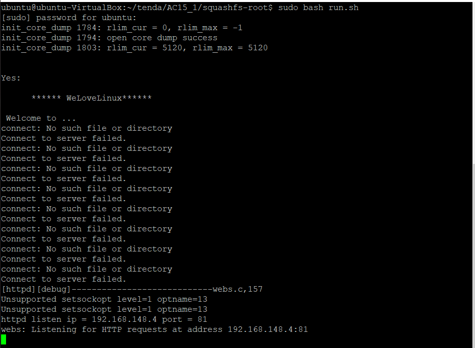                              
这是路由器固件在QEMU中运行以后的结果。可以看到 服务器监听在 192.168.148.4:81。通过浏览器访问192.168.148.4:81与路由器管理界面进行尽可能多的交互，使用Wireshark抓取到不同URI的数据包。对捕获的数据包进行分析，确定数据输入点
以抓取到的其中一共数据包为例：
```bash
1   GET /goform/GetRouterStatus?0.7219206793806395&_=1587978102556  HTTP/1.1
2   Host: 192.168.148.4:81
3   User-Agent: Mozilla/5.0 (X11; Ubuntu; Linux x86_64; rv:75.0) Gecko/20100101 Firefox/75.0
4   Accept: text/plain, */*; q=0.01
5   Accept-Language: en-US,en;q=0.5
6   Accept-Encoding: gzip, deflate
7   X-Requested-With: XMLHttpRequest
8   DNT: 1
9   Connection: keep-alive
10  Cookie:password=""
11  Referer: http://192.168.148.4:81/main.html
```
根据HTTP协议特点及缓冲区溢出漏洞特点，对该请求选取以下数据输入点
第1行，HTTP协议有GET、POST、PUT、DELETE、CONNECT、OPTIONS、TRACE等方法，若方法使用错误可能会超长缓冲区溢出漏洞，例如，相比GET方法，POST方法可以提交更多的数据，若使用POST方法提交的表单误用了GET方法进行提交，会导致查询字符串过长造成溢出，因此把数据包中的GET方法当成一个输入点。若URI超长，服务器在处理请求的时候使用危险函数读取URI或未对URI长度进行限制，也可能导致安全漏洞，因此将URI处也进行模糊测试。第10行，若Cookie超长，程序认证用户身份信息时若用危险函数读取Cookie也可能造成缓冲区溢出，因此将Cookie处进行模糊测试。
24. 选定了一个具体目标，就可编写模糊测试脚本了
根据上述分析，利用Boofuzz提供的原语对HTTP请求进行定义，设置与会话相关的信息，包括目标设备IP地址、端口等。脚本的编写，需要大家查一下BooFuzz的官方文档，查看一是示例代码，比价容易。   
这是在测试过程中的一些截图。                        
                             
上面的截图是在进行测试的时候发现了程序崩溃异常的一个测试数据。在模拟器中监视到了程序崩溃。造成程序异常的数据包主要是其Cookie字段过长，初步判断是由于Cookie字段造成缓冲区溢出导致程序异常退出。                    
                              
有了以上数据以后，就可以将引起崩溃的输入数据在调试环境下再次输入到测试对象，进行调试了。这是上面那个漏洞的相关代码，在IDA-pro调试后定位的漏洞代码。                  
                             
图中的if语句不满足，函数不会读取R3寄存器存储地址，而是直接返回，因此，若在测试数据中添加.gif，则PC寄存器将会被覆盖。这些事后的分析是经过了非常多的调试工作以后确定的。工具主要是GDB和IDA-pro

## 作业
搜集市面上主要的路由器厂家、在厂家的官网中寻找可下载的固件在CVE漏洞数据中查找主要的家用路由器厂家的已经公开的漏洞，选择一两个能下载到切有已经公开漏洞的固件。如果能下载对应版本的固件，在QEMU中模拟运行。确定攻击面（对哪个端口那个协议进行Fuzzing测试），尽可能多的抓取攻击面正常的数据包（wireshark）。查阅BooFuzz的文档，编写这对这个攻击面，这个协议的脚本，进行Fuzzing。配置BooFuzz QEMU的崩溃异常检测，争取触发一次固件崩溃，获得崩溃相关的输入测试样本和日志。尝试使用调试器和IDA-pro监视目标程序的崩溃过程，分析原理。

# 第十节课（2020.5.13）
## 符号执行
1. 符号执行是一种程序分析技术，和模糊测试的思路不一样，模糊测试是吧测试对象当做一个黑盒子，不深入理解内部原理。符号执行是白盒测试技术，是基于程序分析的。或者说是一种程序分析技术，需要解析程序的源码（或者至少是反汇编后的汇编代码）。黑盒测试主要通过操纵其公开接口对软件进行评估，其中最知名的黑盒测试是模糊测试（Fuzzing）。模糊测试或者模糊化是一种软件测试技术，通常是自动化或者半自动化的，它能提供有效的、未预期的、随机的数据作为程序的输入。
2. 模糊测试能产生很多崩溃，分析人员通过这些崩溃作为分析问题的起点，以便确定漏洞的可利用性。然而，因为对程序控制流缺乏语义上的理解，模糊测试有代码覆盖率低的缺陷，即使是当前最高级的模糊测试技术也很难完全覆盖大型程序的所有路径。举个例子，对于以整形数据为路径分支条件，含有长为32比特的常量的约束等式条件（如if(v==4)），Fuzzing测试仍然有可能达到其上限次数（2^32次尝试）才能找到使得此等式为true的值。那么这个if为true分支被测试到的可能性极低。
3. 符号执行就是为解决这个问题而设计的。符号执行作为一种能够系统性探索程序执行路径的程序分析技术，能有效解决模糊测试冗余测试用例过多和代码覆盖率低这两个问题。
4. 符号执行的主要思想是以符号输入代替程序的实际输入，以符号值代替程序运行过程中的实际值，并以符号布尔表达式表示程序中的分支条件。这样，一条程序执行路径就包含了一系列的符号变量、表达式赋值以及约束条件等，程序中的各路径的信息能以符号的形式被完整记录和保存。我们把某条执行路径上的所有分支条件所组成的约束集（Constraint Set）称为路径约束或路径条件（PC, Path Constraint，Path Condition）。符号执行的主要目的是通过对路径约束的求解来判断此条路径的可达性（Feasibility），并能给出执行此条路径的实际测试输入。
5. 这个描述有点抽象，简单来说，符号执行的目的是覆盖程序执行的每一个分支。方法就是查看和收集程序执行过程中每一个分支条件的具体条件，把这些具体条件收集起来，变成一个数学的表达式，然后通过一些方法自动化的求解这些表达式，得到满足执行程序的路径的具体的输入的值。就可以覆盖特定的程序分支了。
6. 举个例子
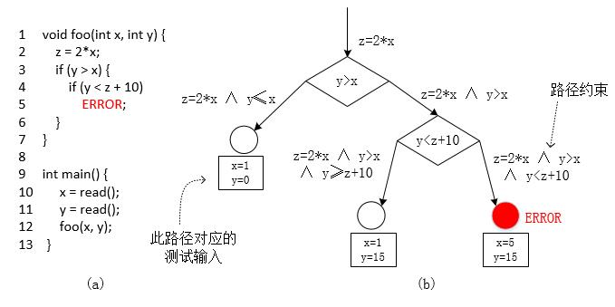                              
* 这个图，左边的是一段示例代码，一共13行，包括两个函数，一个main函数，一个foo函数。程序有两个输入，从外部读入的数据x和y。foo函数以x和y作为条件，内部有分支。假设在第五行有一个bug。我们的目的是有一种自动化的方法来找出这个bug。
* 前面已经说了Fuzzing技术在某些特定情况下有可能极其小得概率才能覆盖到特定分支，所以Fuzzing技术最大的问题就是代码覆盖率不高。对于穷尽每个执行路径目标来说有点难。
* 那么符号执行在解析代码的情况下，首先把程序的每一个分支画出来。形成一个称为符号执行树的数据结构。这个符号执行树，和程序的控制流图有点类似。但是它要明确每个分支的具体的执行路径条件。比如第一个分支的执行条件是y>x，第二个分支的执行条件是y< z+10 。x和y都是输入数据，在数学上来说，都是未知数。如果我们能够有一种方法，可以求解y>x的一个满足解和一个不满足解。那么是不是就找到了覆盖两个分支的两个测试用例。同样，对第二分支来说，在满足y>x的情况下，同时再满足y< z+10或者不满足 y< z+10，就能得到两个二级分支的具体的输入数据。
* 这里多了一个变量z，通过分析代码发现，z并不是一个新的数据数据，所以他并不是未知数，而是其他未知数赋值而来，所以每一个步，我们都记录下这种赋值关系，形成一个“表达式组”，或者，说得简单点，我们初中的时候学的“不等式组”。
* 理论上来讲，每一个程序执行的分支，每一个“执行路径”都有一个确定的不等式组作为执行条件。我们称为“约束”。
* 如果能求解到这个不等式组的一个解，那么就可以构造出专门覆盖这条路径的测试数据了。我们称为“约束求解”
* 这里，对于我们想要找的那个bug，第五行的代码。最终形成一个这样的“约束条件”
                             
是这一个具体路径的路径约束。
7. 下面的问题就是如何求解这个约束。我们的目的当时是自动化求解，不是人工求解。而且我们的目的是得到一个满足解即可，不用得到解析解。也就是只需要得到一个满足这个不等式组的具体的值，就等达到目的。
8. 如果我们把每一个路径的约束全部求解一遍，那么我们就能得到100%代码覆盖率的测试数据集。能够充分测试一个软件，找出软件中所有潜在的bug和漏洞。
9. 想法很好，难度很大。符号执行技术在上个世纪70年代被提出之后，受限于当时计算机的计算能力和约束求解技术的不足，并没有取得太大的进展。近年来，由于可满足模理论(SMT)研究以及动态符号执行技术的提出和应用使得符号执行技术研究有了革命性的进展，并已经被学术界和业界广泛应用于软件测试、漏洞挖掘、模型验证等领域。
也就是上面那个基本想法，已经提出来50年了。但是我们一直找不到一种自动化求解约束表达式的方法，所以也停留在理论层面。但是最近十几二十年情况不一样了。我们有了一种新的方法，并且开发出了工具，可以做到了。
10. 抽象一点，布尔可满足性问题（SAT，Boolean Satisfiability Problem），又称为命题可满足性问题（Propositional Satisfiability Problem），通常缩写为SATISFIABILITY或者SAT。布尔可满足性问题主要作用是在使用某种特定的语言描述对象（变量）的约束条件时，求解出能够满足所有约束条件的每个变量的值。SAT求解器已经被用于解决模型检查、形式化验证和其它包括成千上万变量和约束条件的复杂问题。但SAT问题是个NP完全问题，具有比较高的复杂度，且直接使用SAT求解器对程序进行分析的话需要需将问题转化为CNF形式的布尔公式，这给转化工作带来很大的困难。
11. 学过算法复杂度的同学知道，数学家已经证明了所有的NPC问题，都可以转化为SAT问题，后来发现一种算法，可以缓解这个问题，并在一定程度上求解。具体算法我们不用去深入了解，因为前人已经开发出工具了，简而言之是一种基于多维空间收敛搜索的方法。
## SAT 求解器
1. 这个工具呢，我们称为 SAT 求解器。或者他的变种SMT 求解器。可满足模理论(SMT，Satisfiability Modulo Theories)主要用于自动化推论（演绎），学习方法，为了检查对于一些逻辑理论T的一阶公式的可满足性而提出的。SMT技术主要用于支持可推论的软件验证，在计算机科学领域已经被广泛应用于模型检测（Model Checking），自动化测试生成等。可以被用于检查基于一种或多种理论的逻辑公式的可满足性问题。典型的应用理论主要包括了各种形式的算术运算（Formalizations of Various Forms of Arithmetic），数组（Arrays），有限集（Finite Sets），比特向量（Bit Vectors），代数数据类型（Algebraic Datatypes），字符串（Strings），浮点数（Floating Point Numbers），以及各种理论的结合等。
2. 相对于SAT求解器，而言SMT求解器不仅仅支持布尔运算符，而且在使用SMT求解器的解决问题的时候不需要把问题转化成复杂的CNF范式，这使得问题得以简化。
3. 不过说白了就是一个结论，上面我们总结出来的“约束求解”问题有自动化的方法了，而且已经有人开发了工具了。而且不止一款，有很多款这样的工具。其中比较优秀的是Z3，微软研究院开发的。
                              
## 具体例子
* [约束求解器具体例子](https://rise4fun.com/z3)
1. 打开网页后可以看到的是SMT 求解器使用的一种描述语言。来描述变量之间的约束关系。                       
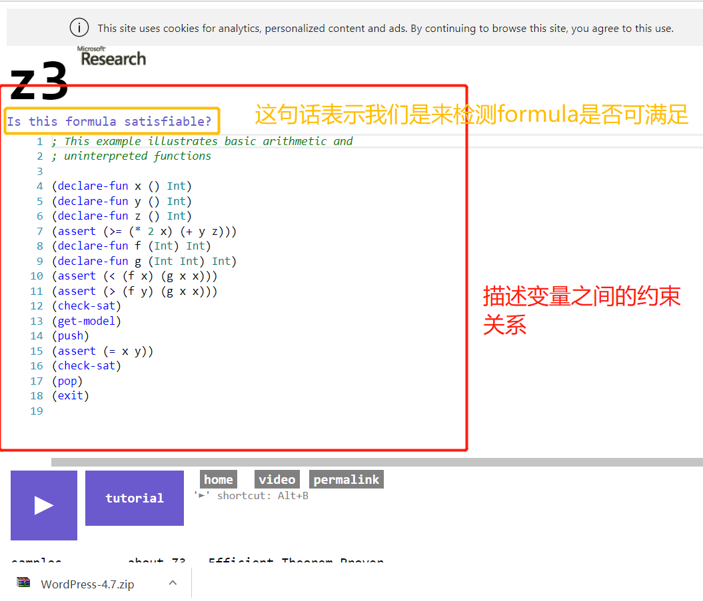                             
2. 简化例子                  
                              
* `Is this formula satisfiable?`这句话已经说明了，我们是来检测这个formula是否可满足的。这个formula呢，按照工具的要求语法，写成一种固定的形式。
* 一二行是注释，3、4、5三行相当于定义了三个变量。这三个变量都是Int型的。
* 7、8两行就是定义了两个约束。这里的写法和我们习惯性的写法略微不一样。运算符写在前面，运算数写在后面。第一个约束表达式实际是。2*x >= y+z。就是一种固定语法而已。
* 9 10 11行是要求求解器做三个具体的事情。
    * 第一个是检测是否这个表达式是否满足。也就是有解还是没有解。当然会有没有解的表达式组的。例如 x>y and x< y 不管xy怎么取值，都没有解。就是一个不满足的情况。
    * 那么我们这个例子中，工具给出的结果是满足 sat。
    * 然后是要 get-model，其实就是得到解。一个具体的满足解。然后求解器给出了x=0 y=0 z=0就能满足两个约束。
* 11行就简单了，告诉求解器，工作做完了可以退出。
* 运行完会发现得出结果 0 0 0
                             
3. 改编使之符合上个例子
```bash
(declare-fun x () Int)
(declare-fun y () Int)
(declare-fun z () Int)
(assert (= z (* 2 x)))
(assert (> x y))
(assert(< y (+ (* 2 x) 10)))
(check-sat)
(get-model)
(exit)

```
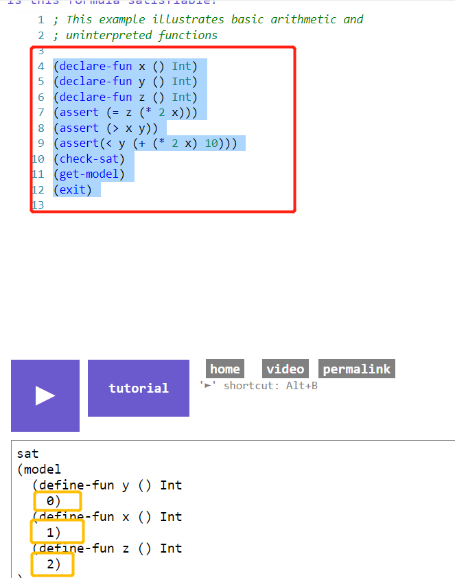                             
## SMT-LIB
1. 然后是不是编程实现这种自动化的格式转化，就能实现一个全自动能完成100%代码覆盖率，生成每一条路径的测试数据的自动化工具。实际上说有的SMT求解器都已经标准化了，上面的那种描述语言是所有约束求解器都遵守的输入语言。成为SMT-LIB.
2. SMT-LIB（The satisfiability modulo theories library）自从2003年开始发起的为SMT理论研究提供标准化支持的项目，旨在促进SMT理论的研究和开发。SMT-LIB的目的主要如下：为SMT系统提供标准化严谨的背景理论描述；发展和促进SMT求解器的输入和输出语言；为SMT求解器研究团队建立和提供大型测试集library等。
定义 如果对于用户声明(declare)的常量和函数，存在一个解（interpretation0能使全局栈里面的所有的公式集（the set of formulas）为true，则我们称这些公式集是可满足（satisfiable）的。
3. 再举个例子                      
                              
* 这个为SMT-LIB V2语言在实际约束求解中的应用。其中declare-fun 命令用于声明一个函数，当函数里面参数为空时，表示声明一个符号常量；assert命令用于添加一个约束式formula到SMT全局栈里面；check-sat 命令决定在栈里面的公式（formulas)是否是可满足的，如果是，则返回sat，如果不满足（not satisfiable，即unsatisfiable)，则返回unsat，如果求解器无法根据已有的formula决定是否满足，则返回unknown；get-value命令用于在check-sat命令返回的结果是sat的前提下获取满足使SMT求解器全局栈中所有formulas为true的其中的一个解。
4. 当前很多非常著名的软件测试工具都采用了符号执行技术，而且已经有很大一部分开放了源代码。例如：NASA的Symbolic (Java) PathFinder，伊利诺大学香槟分校（UIUC）的 CUTE和jCUTE，斯坦福大学（Stanford）的 KLEE, 加利福尼亚大学伯克利分校（UC Berkeley）的 CREST和 BitBlaze，瑞士洛桑联邦理工学院（EPEL）的S2E，卡内基梅隆大学（CMU）的Mayhem和Mergepoint，加利福尼亚大学圣巴巴拉分校（UC Santa Barbar)的angr等。
在工业领域也有符号执行工具被广泛使用，如Microsoft(Pex, SAGE, YOGI和PREfix), IBM (Apollo), NASA 和Fujitsu的 (Symbolic PathFinder)等。
5. 可以看出来，符号执行确实是计算机领域一个非常重要的研究点。很多著名大学都在研究这个东西。也包括一些非大学的著名研究机构。这些工具发现了很多软件的bug。比如SAGE，win7三分之一的安全漏洞是它发现的。
6. 上面说了这么多符号执行工具，这些工具是把我们刚才说的整个过程都实现了：根据代码生成符号执行树->收集路径的约束->转为SMT-LIB格式->输入给约束求解器->验证路径可达或者不可达，可达的情况下获得解->根据解自动构造输入数据
## [KLEE](https://klee.github.io/)
* [KLEE](https://klee.github.io/)
> 环境是Linux
1. 不同的符号执行工具在实现时有不同比如KLEE，只能分析C源码程序。后续的一些工具可以分析二进制程序。
KLEE是开源的，而且比较成熟文档比较多
2. KLEE能实现全自动化，唯一的缺点是需要在程序中进行少量的修改。                  
3. 例子                         
                              
* 这个`klee_make_symbolic(&a, sizeof(a), "a");`的作用就是a标记为需要求解的输入数据。
4. BitBlaze还有一些后续工具，能够实现输入数据的自动识别，更高级一些。
5. 使用KLEE一共就几个步骤：准备一份源码，标记要分析的输入数据，编译，使用KLEE来运行编译后的程序，得到KLEE自动生成的测试用例。最后把所有输入测试用例循环输入给被测试程序，完成自动测试。
6. 按照[官方的教程](https://klee.github.io/tutorials/testing-function/)，做一遍，比较简单。大家都能做到。
7. 还有一个比较有趣的例子，是使用KLEE，来完成[自动走迷宫](https://github.com/grese/klee-maze)。能fq的同学 直接访问这个[blog](https://feliam.wordpress.com/2010/10/07/the-symbolic-maze/)这是一个迷宫小游戏。
8. 先把这个迷宫小游戏的代码整理编译运行一下，然后在教程的基础上使用KLEE来完成这个迷宫游戏的自动探路。体验一下符号执行是如何去根据程序分析来自动生成满足特定约束条件、覆盖指定程序执行路径的输入数据的。
9. 最后补充一点，KLEE当然不是使用的在线版本的示例性质的约束求解器。而是直接调用本地的二进制程序。Windows和Linux下都有Z3的可执行程序，Windows系统中是z3.exe，可以在官网下载。
## 符号执行的主要问题
1. 当程序中有循环的时候，按照符号执行树，每一个分支条件都是需要展开。这会造成程序的路径非常多。
* 循环是程序的一个基本结构，普遍存在的。这种情况要遍历每一个路径，实际路径数量会非常巨大。造成消耗的时间不可行。
* 这个问题称为路径爆炸，路径的数据量是分支数量的指数级。循环更加强了这个问题。还有当程序路径非常多，输入变量非常多的时候，会超过SMT求解的求解能力。
* 所以对大型程序，目前符号执行只是一种辅助性的手段。但是这种技术是有前景的，随着计算能力的增强，算法的优化和改进，未来可能成为程序分析、程序自动化测试和程序安全性分析的主要的形式化的方法。

## 作业
1. 作业：安装KLEE，完成官方tutorials。至少完成前三个，有时间的同学可以完成全部一共7个。
* 后面几个也很有意思，比如用KLEE来生成keygen，获得软件激活注册码。

                             
                              
                             
                              
                             
                              
                             
                              
                             
                              
                             
                              
                             
                              
                             
                              
# 
# 
                             
                              
                             
                              
                             
                              
                             
                              
                             
                              
                             
                              
                             
                              
                             
                              
                             
                              

## 参考资料
* [http请求的方法](https://developer.mozilla.org/en-US/docs/Web/HTTP/Methods)
* [Django官方文档](https://docs.djangoproject.com/en/3.0/intro/tutorial01/)
* [sqlite的客户端软件](https://www.sqlite.org/download.html)
* [intel程序开发手册](https://software.intel.com/sites/default/files/managed/39/c5/325462-sdm-vol-1-2abcd-3abcd.pdf)
* [QEMU](https://www.qemu.org/)